<div align="center">
  <p><a href="./README.md">中文</a> | English</p>
  <h1>DataSentry</h1>
  <p>
    <strong>An Open-Source Data Cleaning Platform for the AI Era (with Intelligent Data Analysis Engine)</strong>
  </p>
  <p>
    Real-time Cleaning · Batch Governance · Rollback-safe Write-back · Human Review Loop · Compliance Audit
  </p>

  <p>
    <a href="https://github.com/alibaba/spring-ai-alibaba"></a>
    
    
    
    
    <a href="https://deepwiki.com/TouHouQing/DataSentry"></a>
  </p>

  <p>
    <a href="#-positioning">Positioning</a> •
    <a href="#-open-source-competitiveness">Open-Source Competitiveness</a> •
    <a href="#-capability-matrix-current-progress">Capability Matrix</a> •
    <a href="#-quick-start">Quick Start</a> •
    <a href="#-document-map">Document Map</a> •
    <a href="#-roadmap--transformation-plan">Roadmap</a>
  </p>
</div>

---

## 🎯 Positioning

**DataSentry** is an open-source data governance project built on **Spring AI Alibaba**, currently focused on:

> **An AI / Compliance-oriented Data Cleaning Platform**

It is not a single-point “keyword filter.” Instead, it covers a full closed-loop capability:

- Real-time detection and masking (online requests)
- Batch scanning and governance (historical data)
- Backup-before-write and rollback recovery
- Human review routing and approval execution
- Cost, metrics, alerts, and audit evidence

At the same time, the project keeps its original intelligent data analysis capabilities (Text-to-SQL, Python analysis, report generation).

---

## 🧱 Open-Source Competitiveness

DataSentry’s competitiveness comes from:

### 1) Closed-loop capability, not point tools
Many open-source solutions only solve one step such as “detection” or “data quality validation.” DataSentry emphasizes:
**Detect → Decide → Execute → Rollback → Review → Audit**.

### 2) Controllable risk, suitable for production governance
- Backup before write-back
- Task-based rollback execution
- Review and conflict handling mechanism
- Budget thresholds and downgrade strategy

This makes it more suitable for high-risk business data governance, not just offline analysis experiments.

### 3) Open and controllable, avoiding vendor lock-in
- Java 17 + Spring Boot backend, Vue 3 frontend
- Private deployment with deep customization based on organizational standards
- No dependency on closed SaaS black-box decision paths

### 4) AI capability and cost governance together
The project does not “blindly rely on large models.” It supports layered rules/light models/LLM with budget control, balancing quality and cost.

### 5) Friendly for enterprise adoption in local environments
- Deployable with data staying in-domain
- Auditing and compliance capabilities can be strengthened
- Tech stack and operational model align well with enterprise teams

---

## ✨ Capability Matrix (Current Progress)

> Status legend: ✅ Implemented (stable) / 🚧 In transformation (already has base) / 📋 Planned

### Data Cleaning Platform Capabilities

| Domain | Capability | Status | Description |
| :--- | :--- | :---: | :--- |
| Real-time Cleaning | `/check`, `/sanitize` | ✅ | Online detection and masked response |
| Batch Governance | Job/Run, pause/resume/cancel | ✅ | Supports lease and checkpoint resume |
| Write-back Governance | Masked write-back, soft delete | ✅ | Includes type validation and safety gates |
| Rollback Capability | Rollback runs, scheduled recovery | ✅ | Rollback execution chain is available |
| Human Review Capability | Review tasks, batch approval | ✅ | Can write back/reject after approval |
| Risk Governance | Budget, cost ledger | ✅ | Supports soft/hard threshold visibility |
| Operations Observability | Metrics, alerts, DLQ | ✅ | Ops dashboard is available |
| Shadow Mode | Sampling observation | 🚧 | Dual-track comparison experiment in progress |
| Policy Governance | Snapshot bound to Run | 🚧 | Publish/rollback governance strengthening |
| Rollback Validation | Basic recovery available | 🚧 | Conflict grading and validation strengthening |
| Backup Mode Expansion | METADB stable | 🚧 | BUSINESS_DB mode enhancement pending |
| Composite Primary Key | Single primary key stable | 🚧 | Composite primary key enhancement in progress |
| Playground | Policy sandbox | 📋 | Planned |

### Intelligent Data Analysis Capabilities

| Capability | Status | Description |
| :--- | :---: | :--- |
| Text-to-SQL | ✅ | Multi-table query and natural language analysis |
| Python Deep Analysis | ✅ | Auto-generates and executes analysis code |
| Intelligent Report Generation | ✅ | Outputs charts and reports |
| RAG Enhancement | ✅ | Semantic retrieval of business knowledge |
| MCP Service Capability | ✅ | Integrates with MCP ecosystem |

---

## 🏗 Architecture Overview

### Current Platform-oriented Architecture Thinking

- **Policy Layer**: policies, rules, allowlist, action matrix
- **Execution Layer**: real-time cleaning, batch processing, rollback, review execution
- **Governance Layer**: budget, alerts, shadow experiments, release governance
- **Evidence Layer**: cleaning records, review records, rollback records, postmortem evidence

```mermaid
flowchart TB
    A[策略层\nPolicy/Rule/Allowlist] --> B[执行层\nRealtime + Batch]
    B --> C[回滚层\nBackup + Rollback Run]
    B --> D[审核层\nReview Queue + Decision]
    B --> E[治理层\nBudget + Metrics + Alerts]
    C --> F[证据层\nAudit & Evidence]
    D --> F
    E --> F
```



For detailed design, see:
- `docs/AI_CLEANING_PLATFORM_ARCHITECTURE.md`
- `docs/DATA_CLEANING_ARCHITECTURE.md`

---

## 🚀 Quick Start

### 1) Environment Requirements

- JDK 17+
- Maven 3.6+
- MySQL 5.7+ (or PostgreSQL 12+)
- Node.js 16+

### 2) Initialize Database

```bash
# MySQL
mysql -u root -p < datasentry-management/src/main/resources/sql/schema.sql

# Optional: import sample data
mysql -u root -p < datasentry-management/src/main/resources/sql/data.sql
```

### 3) Start Backend and Frontend

```bash
# Backend
cd datasentry-management
./mvnw spring-boot:run

# Frontend (new terminal)
cd datasentry-frontend
npm install
npm run dev
```

### 4) Quick Call to Cleaning API

```bash
curl -X POST http://localhost:8080/api/datasentry/cleaning/1/check \
  -H "X-API-KEY: <your_api_key>" \
  -H "Content-Type: application/json" \
  -d '{"text":"My phone number is 13800138000, email is zhangsan@example.com"}'
```

---

## 📚 Document Map

### Core Documents

- Quick Start: `docs/QUICK_START.md`
- System Architecture: `docs/ARCHITECTURE.md`
- Data Cleaning Architecture: `docs/DATA_CLEANING_ARCHITECTURE.md`
- Cleaning API (P2): `docs/CLEANING_API_P2.md`
- Developer Guide: `docs/DEVELOPER_GUIDE.md`

### Platform Transformation Documents (New)

- Platform Blueprint: `docs/AI_COMPLIANCE_CLEANING_PLATFORM.md`
- Requirements Document (PRD): `docs/AI_CLEANING_PLATFORM_REQUIREMENTS.md`
- Architecture Redesign: `docs/AI_CLEANING_PLATFORM_ARCHITECTURE.md`
- Transformation Development Plan: `docs/AI_CLEANING_PLATFORM_DEVELOPMENT_GUIDE.md`

---

## 🛣 Roadmap & Transformation Plan

> The current roadmap is not “development from scratch,” but platform-oriented transformation on top of existing capabilities.

### P0 (Highest Priority)
- Upgrade shadow mode from sampling to dual-track comparison
- Complete policy publish/rollback governance
- Strengthen rollback validation and conflict grading handling

### P1 (Mainline Enhancements)
- Review operations model (backlog, SLA, priority)
- Unified evidence archiving (cleaning/review/rollback)
- Batch boundary expansion reserve (composite PK, backup modes)

### P2 (Optimization Gains)
- Quality-cost combined dashboard
- Review-feedback-driven policy optimization
- Analytics as a post-processing capability: Text-to-SQL / Python / report-based governance review from cleaning audit data
- Automated governance operations reporting: false-positive/false-negative, rollback success rate, review SLA, and cost trend

See detailed schedule: `docs/AI_CLEANING_PLATFORM_DEVELOPMENT_GUIDE.md`

---

## 🎯 Fit & Boundaries

### Good Fit
- Data cleaning scenarios requiring private deployment and auditability
- High-risk governance scenarios requiring rollback-safe write-back + human review fallback
- Teams that want continuous policy iteration based on their own business

### Not Ideal Fit
- Lightweight scenarios only needing single-point keyword blocking without governance loop
- Teams pursuing fully managed SaaS with no self-hosted engineering

---

## 🔐 Security & Compliance Principles

- Least privilege by default
- Controlled execution for high-risk actions
- Traceable audit chain
- Verifiable backup and rollback
- Masking and lifecycle governance throughout the processing flow

---

## 🤝 Open Source Contribution

Contributions via Issue / PR are welcome:

- Contribution Guide: `docs/DEVELOPER_GUIDE.md`
- Issue Feedback: <https://github.com/TouHouQing/DataSentry/issues>

- This project is **DataSentry**, a derivative work based on the open-source **DataAgent** (Apache-2.0).
- Original license and attribution notices are preserved, with feature and branding upgrades on top.
- Thanks to [Spring AI Alibaba](https://github.com/alibaba/spring-ai-alibaba) for powerful AI orchestration capabilities.

## 🤝 Community & Contribution

- **Contribution Guide**: Community contributions are welcome! Please read the [Developer Guide](docs/DEVELOPER_GUIDE.md) to learn how to submit a PR.
- **Issue Feedback**: If you have any questions or suggestions, please report them via [GitHub Issues](https://github.com/TouHouQing/DataSentry/issues).
- **Contact**: WeChat `tohoqing` with note “DataSentry”.

## 📄 License

This project is licensed under Apache License 2.0. See [LICENSE](LICENSE) for details.

## ⭐ Star History

[](https://star-history.com/#TouHouQing/DataSentry&Date)

## 👥 Contributors List

<a href="https://github.com/TouHouQing/DataSentry/graphs/contributors">
  
</a>

---

<div align="center">
    Made with ❤️ by DataSentry Team
</div>
