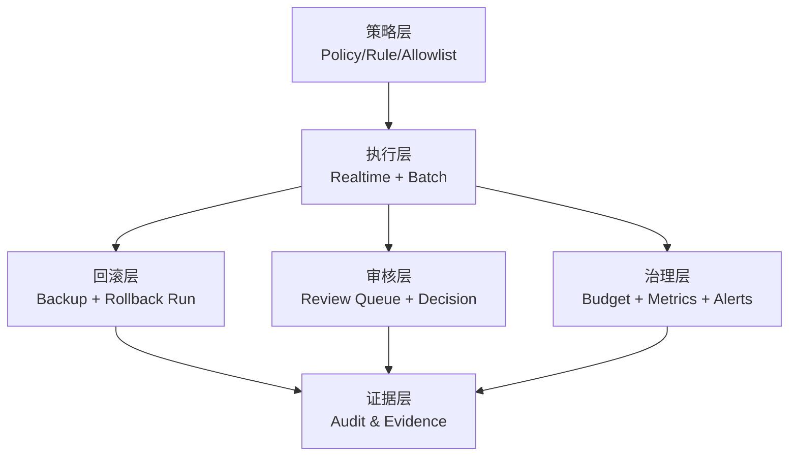

<div align="center">
  <p>中文 | <a href="./README-en.md">English</a></p>
  <h1>DataSentry</h1>
  <p>
    <strong>面向 AI 时代的开源数据清洗中台（含智能数据分析引擎）</strong>
  </p>
  <p>
    实时清洗 · 批处理治理 · 可回滚写回 · 人审闭环 · 合规审计
  </p>

  <p>
    <a href="https://github.com/alibaba/spring-ai-alibaba"></a>
    
    
    
    
    <a href="https://deepwiki.com/TouHouQing/DataSentry"></a>
  </p>

  <p>
    <a href="#-项目定位">项目定位</a> •
    <a href="#-开源竞争力">开源竞争力</a> •
    <a href="#-能力矩阵当前进度">能力矩阵</a> •
    <a href="#-快速开始">快速开始</a> •
    <a href="#-文档地图">文档地图</a> •
    <a href="#-路线图与改造计划">路线图</a>
  </p>
</div>

---

## 🎯 项目定位

**DataSentry** 是一个基于 **Spring AI Alibaba** 的开源数据治理项目，当前重点定位为：

> **AI / 合规导向的数据清洗中台**

它不是单点“敏感词过滤器”，而是覆盖以下闭环能力：

- 实时检测与脱敏（在线请求）
- 批处理扫描与治理（存量数据）
- 写回前备份与可回滚恢复
- 人审分流与审批执行
- 成本、指标、告警、审计证据

同时，项目保留了原有的智能数据分析能力（Text-to-SQL、Python 分析、报告生成）。

---

## 🧱 开源竞争力

DataSentry 的竞争力在于：

### 1) 闭环能力，而非点状工具
很多开源方案只解决“检测”或“质量校验”单环节。DataSentry 强调的是：
**检测 → 决策 → 执行 → 回滚 → 审核 → 审计**。

### 2) 风险可控，适合生产治理
- 写回前备份
- 回滚任务化执行
- 审核与冲突处理机制
- 预算阈值与降级策略

这让它更适合高风险业务数据治理，而不只是离线分析实验。

### 3) 开源可控，避免供应商锁定
- 后端 Java 17 + Spring Boot，前端 Vue 3
- 可私有化部署，可按组织规范深度二开
- 不依赖闭源 SaaS 的黑盒决策路径

### 4) AI 能力与成本治理并重
项目不是“盲目上大模型”，而是支持规则/轻模型/LLM 分层与预算控制，强调效果和成本平衡。

### 5) 对国内企业落地友好
- 数据不出域可部署
- 审计与合规能力可增强
- 开发栈、运维栈和团队结构匹配度高

---

## ✨ 能力矩阵（当前进度）

> 状态说明：✅ 已实现（稳定） / 🚧 改造中（已有基础） / 📋 规划中

### 数据清洗中台能力

| 能力域 | 子能力 | 状态 | 说明 |
| :--- | :--- | :---: | :--- |
| 实时清洗 | `/check`、`/sanitize` | ✅ | 在线检测与脱敏返回 |
| 批处理治理 | Job/Run、暂停/恢复/取消 | ✅ | 支持租约与断点续跑 |
| 写回治理 | 脱敏写回、软删 | ✅ | 带类型校验与安全闸 |
| 回滚能力 | 回滚任务、调度恢复 | ✅ | 已有回滚执行链路 |
| 人审能力 | 审核任务、批量审批 | ✅ | 审批后可写回/拒绝 |
| 风险治理 | 预算、成本台账 | ✅ | 支持软硬阈值视图 |
| 运维观测 | 指标、告警、DLQ | ✅ | 运维看板可用 |
| 影子模式 | 采样观测 | 🚧 | 双轨对照实验改造中 |
| 策略治理 | 快照绑定 Run | 🚧 | 发布/回退治理增强中 |
| 回滚验证 | 基础恢复可用 | 🚧 | 冲突分级与验证增强中 |
| 备份模式扩展 | METADB 稳定 | 🚧 | BUSINESS_DB 模式待增强 |
| 复合主键 | 单主键稳定 | 🚧 | 复合主键支持改造中 |
| Playground | 策略沙箱 | 📋 | 规划中 |

### 智能数据分析能力

| 能力 | 状态 | 说明 |
| :--- | :---: | :--- |
| Text-to-SQL | ✅ | 多表查询与自然语言分析 |
| Python 深度分析 | ✅ | 自动生成并执行分析代码 |
| 智能报告生成 | ✅ | 输出图表与报告 |
| RAG 增强 | ✅ | 语义检索业务知识 |
| MCP 服务能力 | ✅ | 可对接 MCP 生态 |

---

## 🏗 架构概览

### 当前中台化架构思路

- **策略层**：策略、规则、白名单、动作矩阵
- **执行层**：在线清洗、批处理、回滚、审核执行
- **治理层**：预算、告警、影子实验、发布治理
- **证据层**：清洗记录、审核记录、回滚记录、复盘证据



详细设计请看：
- `docs/AI_CLEANING_PLATFORM_ARCHITECTURE.md`
- `docs/DATA_CLEANING_ARCHITECTURE.md`

---

## 🚀 快速开始

### 1) 环境要求

- JDK 17+
- Maven 3.6+
- MySQL 5.7+（或 PostgreSQL 12+）
- Node.js 16+

### 2) 初始化数据库

```bash
# MySQL
mysql -u root -p < datasentry-management/src/main/resources/sql/schema.sql

# 可选：导入示例数据
mysql -u root -p < datasentry-management/src/main/resources/sql/data.sql
```

### 3) 启动后端与前端

```bash
# 后端
cd datasentry-management
./mvnw spring-boot:run

# 前端（另开终端）
cd datasentry-frontend
npm install
npm run dev
```

### 4) 快速调用清洗 API

```bash
curl -X POST http://localhost:8080/api/datasentry/cleaning/1/check \
  -H "X-API-KEY: <your_api_key>" \
  -H "Content-Type: application/json" \
  -d '{"text":"我的手机号是13800138000，邮箱是zhangsan@example.com"}'
```

---

## 📚 文档地图

### 核心文档

- 快速开始：`docs/QUICK_START.md`
- 系统架构：`docs/ARCHITECTURE.md`
- 数据清洗架构：`docs/DATA_CLEANING_ARCHITECTURE.md`
- 清洗 API（P2）：`docs/CLEANING_API_P2.md`
- 开发者指南：`docs/DEVELOPER_GUIDE.md`

### 中台改造文档（新增）

- 中台总蓝图：`docs/AI_COMPLIANCE_CLEANING_PLATFORM.md`
- 需求文档（PRD）：`docs/AI_CLEANING_PLATFORM_REQUIREMENTS.md`
- 架构重设计：`docs/AI_CLEANING_PLATFORM_ARCHITECTURE.md`
- 改造开发计划：`docs/AI_CLEANING_PLATFORM_DEVELOPMENT_GUIDE.md`

---

## 🛣 路线图与改造计划

> 当前路线不是“从零开发”，而是在已有能力上做中台化改造。

### P0（优先完成）
- 影子模式从采样升级到双轨对照
- 策略发布/回退治理补齐
- 回滚验证与冲突分级处置增强

### P1（主线增强）
- 审核运营模型（积压、SLA、优先级）
- 证据统一归档（清洗/审核/回滚）
- 批处理边界扩展预留（复合主键、备份模式）

### P2（增益优化）
- 质量-成本联合看板
- 审核反馈驱动策略优化
- 分析作为后置能力：基于清洗审计数据提供 Text-to-SQL / Python / 报告联动复盘
- 治理运营报告自动化：输出误杀/漏杀、回滚成功率、人审 SLA、成本趋势

详细排期见：`docs/AI_CLEANING_PLATFORM_DEVELOPMENT_GUIDE.md`

---

## 🎯 适用与边界

### 适合
- 需要私有化与可审计的数据清洗场景
- 需要“可回滚写回 + 人审兜底”的高风险治理场景
- 希望按自身业务持续迭代策略的团队

### 暂不适合
- 只需要单点关键词拦截、无需治理闭环的轻场景
- 追求即开即用全托管 SaaS、无需自建能力的团队

---

## 🔐 安全与合规原则

- 默认最小权限
- 高风险动作受控执行
- 审计链路可追溯
- 备份与回滚可验证
- 过程数据遵循脱敏与生命周期治理

---

## 🤝 开源贡献

欢迎通过 Issue / PR 参与共建：

- 贡献指南：`docs/DEVELOPER_GUIDE.md`
- 问题反馈：<https://github.com/TouHouQing/DataSentry/issues>

- 本项目为 **DataSentry**，基于开源项目 **DataAgent**（Apache-2.0）二次开发。
- 已保留原始许可与版权声明，并在此基础上进行功能与品牌升级。
- 感谢 [Spring AI Alibaba](https://github.com/alibaba/spring-ai-alibaba) 提供强大的 AI 编排能力。

## 🤝 加入社区 & 贡献

- **贡献指南**：欢迎社区贡献！请查阅 [开发者文档](docs/DEVELOPER_GUIDE.md) 了解如何提交 PR。
- **问题反馈**：如有任何问题或建议，请通过 [GitHub Issues](https://github.com/TouHouQing/DataSentry/issues) 报告。
- **联系方式**：微信 `tohoqing` 备注 DataSentry

## 📄 许可证

本项目采用 Apache License 2.0 许可证。详见 [LICENSE](LICENSE) 文件。

## ⭐ Star 历史

[](https://star-history.com/#TouHouQing/DataSentry&Date)

## 👥 贡献者名单

<a href="https://github.com/TouHouQing/DataSentry/graphs/contributors">
  
</a>

---

<div align="center">
    Made with ❤️ by DataSentry Team
</div>
