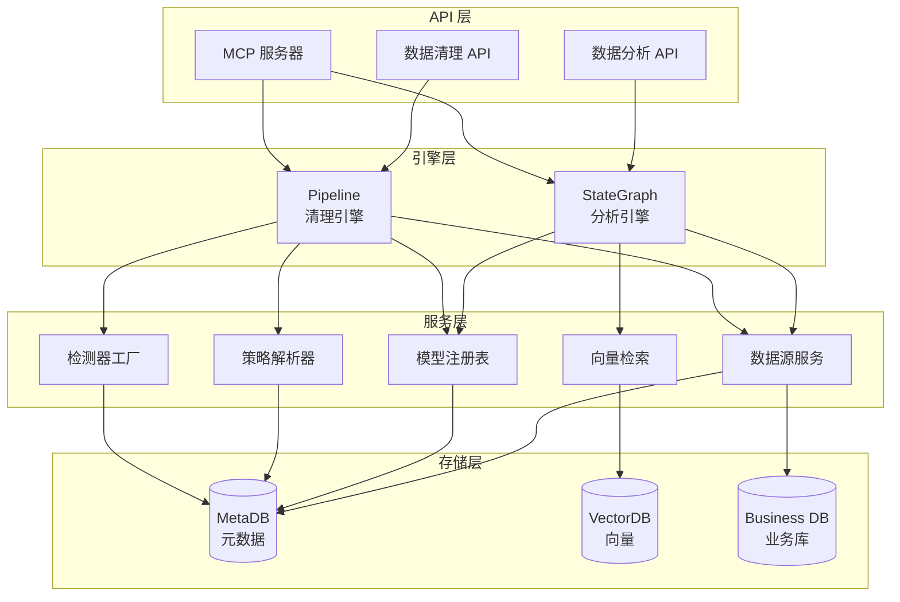
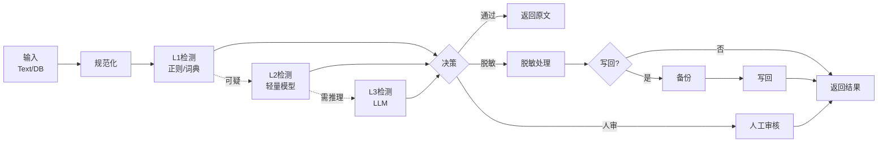

<div align="center">
  <p>中文 | <a href="./README-en.md">English</a></p>
  <h1>DataSentry</h1>
  <p>
    <strong>基于 <a href="https://github.com/alibaba/spring-ai-alibaba" target="_blank">Spring AI Alibaba</a> 的企业级智能数据治理与分析平台</strong>
  </p>
  <p>
     智能数据分析 | 内容安全审核 | 敏感信息治理 | Text-to-SQL | MCP 服务器
  </p>

  <p>
    <a href="https://github.com/alibaba/spring-ai-alibaba"></a>
    
    
    
    <a href="https://deepwiki.com/TouHouQing/DataSentry"></a>
  </p>

   <p>
    <a href="#-项目简介">项目简介</a> •
    <a href="#-核心能力">核心能力</a> •
    <a href="#-快速开始">快速开始</a> •
    <a href="#-文档导航">文档导航</a> •
    <a href="#-开源与致谢">开源与致谢</a> •
    <a href="#-加入社区--贡献">加入社区</a>
  </p>
</div>

<br/>

## 📖 项目简介

**DataSentry** 是一个基于 **Spring AI Alibaba** 打造的企业级智能数据治理与分析平台，提供 **双引擎能力**：

### 🎯 双引擎架构

**数据分析引擎**：基于 StateGraph 的智能数据分析
- Text-to-SQL：自然语言转 SQL，支持多表关联与复杂查询
- Python 深度分析：自动生成统计分析与预测代码
- 智能报告生成：自动输出包含 ECharts 可视化的分析报告
- RAG 增强：语义检索业务元数据，提升 SQL 生成准确率

**数据清理引擎**：可配置的内容安全与敏感信息治理（全新能力）
- 敏感信息检测与脱敏：PII（手机号/身份证/邮箱等）自动识别与处理
- 垃圾内容识别：基于规则/词典/模型的多级联检测
- 双输入通道：实时文本审核 API + 数据库存量批处理
- 可配置 Pipeline：检测返回/脱敏返回/写回/人审/软删/硬删等动作可灵活组合
- 备份与回滚：企业级数据安全保障，支持行级备份与精确回滚

### 🏗 技术特性

- **StateGraph 工作流编排**：可视化节点编排，支持人工中断与恢复，多轮对话上下文管理
- **多模型调度**：内置模型注册表，运行时动态切换 LLM/Embedding
- **灵活扩展**：全面兼容 OpenAI 接口规范，可接入 Qwen/Deepseek 等主流模型
- **向量数据库**：开箱即用支持 SimpleVectorStore，可扩展接入 Milvus/PGVector/ElasticSearch/AnalyticDB 等
- **MCP 协议支持**：可作为 MCP 服务器集成到 Claude Desktop 等生态工具
- **成本与监控**：预算管理、成本统计、指标收集、告警视图、多通道通知
- **策略版本化**：JobRun 绑定策略快照，运行时不可变，支持灰度与回滚
- **API Key 认证**：基于 Agent 的 API Key 访问控制（基础实现）

## ✨ 核心能力

### 数据分析能力（已实现）

| 特性 | 说明 | 状态 |
| :--- | :--- | :--- |
| **Text-to-SQL** | StateGraph 驱动的自然语言转 SQL，支持复杂多表与多轮意图理解 | ✅ 已实现 |
| **Python 执行器** | 内置 Python 沙箱，自动生成并执行统计分析与预测代码 | ✅ 已实现 |
| **智能报告** | 结果自动汇总为包含 ECharts 的 HTML/Markdown 报告 | ✅ 已实现 |
| **RAG 检索增强** | 语义检索业务元数据与术语库，提升 SQL 生成准确率 | ✅ 已实现 |
| **多数据源支持** | MySQL/PostgreSQL/Oracle/SQL Server/达梦/H2 等 | ✅ 已实现 |
| **MCP 服务器** | 遵循 MCP 协议，支持作为 Tool Server 对外提供能力 | ✅ 已实现 |

### 数据清理能力（全新实现）

| 特性 | 说明 | 状态 |
| :--- | :--- | :--- |
| **实时文本审核** | `/check` 和 `/sanitize` API，低延迟检测与脱敏 | ✅ 已实现 |
| **敏感信息检测** | 内置手机号/邮箱/身份证/银行卡等 PII 检测规则 | ✅ 已实现 |
| **垃圾内容识别** | 基于规则/词典/LLM 的级联检测（L1/L2/L3 三级架构） | ✅ 已实现 |
| **可配置策略** | 策略集/规则/绑定三层模型，支持场景化策略管理 | ✅ 已实现 |
| **白名单管理** | 字段级/全局/模式匹配白名单，降低误杀率 | ✅ 已实现 |
| **批处理扫描** | 数据库存量数据扫描与治理，支持断点续跑 | ✅ 已实现 |
| **写回与回滚** | 双模备份（MetaDB/业务库），行级快照，精确回滚 | ✅ 已实现 |
| **人工审核流程** | 可配置人审策略（ALWAYS/ON_RISK/NEVER） | ✅ 已实现 |
| **审计与合规** | 全链路脱敏、最小权限、审计可追溯 | ✅ 已实现 |
| **分布式调度** | 基于 MetaDB 租约机制的无中间件分布式任务调度 | ✅ 已实现 |
| **成本管理** | 预算控制、成本渠道、定价同步、使用统计 | ✅ 已实现 |
| **监控告警** | 指标收集、告警视图、性能监控 | ✅ 已实现 |
| **JSON 字段脱敏** | 支持 JSONPath 提取与局部脱敏 | ✅ 已实现 |
| **通知通道** | Webhook/Email/飞书/钉钉等通知能力 | 🚧 部分实现 |
| **影子模式** | 流量复制验证，无风险测试新策略 | 🚧 部分实现 |
| **Playground** | 策略沙箱调试，无风险验证规则效果 | 📋 规划中 |

### 动作模式（数据清理）

| 模式 | 结果输出 | 写回 | 人审 | 适用场景 |
|---|---|---|---|---|
| `DETECT_ONLY` | 检测结果 | 否 | 否 | 安全评估、统计分析 |
| `SANITIZE_RETURN` | 脱敏文本 + 检测结果 | 否 | 否 | 实时内容展示 |
| `SANITIZE_WRITEBACK` | 脱敏文本 + 检测结果 | 是 | 可选 | 存量数据清理 |
| `REVIEW_THEN_WRITEBACK` | 检测结果 | 是 | 是 | 高风险数据处理 |
| `DELETE` | 删除结果 | 是 | 可选 | 垃圾数据清除 |

## 🚀 快速开始

> 详细的安装和配置指南请参考 [📑 快速开始文档](docs/QUICK_START.md)。

### 1. 环境要求

- **JDK 17+**
- **MySQL 5.7+** 或 **PostgreSQL 12+**
- **Node.js 16+** （前端开发需要）
- **Maven 3.6+**

### 2. 数据库初始化

```bash
# MySQL
mysql -u root -p < datasentry-management/src/main/resources/sql/schema.sql

# 可选：导入示例数据
mysql -u root -p < datasentry-management/src/main/resources/sql/data.sql
```

### 3. 配置文件

编辑 `datasentry-management/src/main/resources/application.yml`：

```yaml
spring:
  datasource:
    url: jdbc:mysql://localhost:3306/datasentry?useUnicode=true&characterEncoding=utf-8
    username: root
    password: <your_db_password>

# 数据清理功能开关
datasentry:
  cleaning:
    enabled: true  # 启用数据清理功能
    backup:
      encryption:
        provider: local  # 或 kms
        master-key: ${DATASENTRY_BACKUP_MASTER_KEY}  # 从环境变量读取
```

### 4. 启动服务

```bash
# 后端服务
cd datasentry-management
./mvnw spring-boot:run

# 前端服务（可选）
cd datasentry-frontend
npm install && npm run dev
```

### 5. 访问系统

- **前端界面**：http://localhost:3000
- **后端 API**：http://localhost:8080
- **API 文档**：http://localhost:8080/swagger-ui.html

### 6. 快速体验数据清理

```bash
# 1. 检测敏感信息
curl -X POST http://localhost:8080/api/datasentry/cleaning/1/check \
  -H "X-API-Key: <your_api_key>" \
  -H "Content-Type: application/json" \
  -d '{"text": "我的手机号是13800138000，身份证号是110101199001011234"}'

# 2. 脱敏处理
curl -X POST http://localhost:8080/api/datasentry/cleaning/1/sanitize \
  -H "X-API-Key: <your_api_key>" \
  -H "Content-Type: application/json" \
  -d '{"text": "联系方式：zhangsan@example.com，电话13800138000"}'
```

## 🏗 架构设计

### 双引擎架构图



### 数据清理 Pipeline 流程



## 📚 文档导航

| 文档 | 内容概览 |
| :--- | :--- |
| [📘 快速开始](docs/QUICK_START.md) | 环境要求、数据库导入、基础配置、系统初体验 |
| [🏛 架构设计](docs/ARCHITECTURE.md) | 系统分层架构、StateGraph 工作流、核心模块时序图 |
| [🧹 数据清理架构](docs/DATA_CLEANING_ARCHITECTURE.md) | 清理引擎设计、Pipeline 流程、备份回滚机制 |
| [📐 数据清理改造方案](docs/AGENT_DATA_CLEANING_REFACTOR.md) | 完整的技术方案、领域模型、实施路线图 |
| [💻 开发者指南](docs/DEVELOPER_GUIDE.md) | 开发环境搭建、详细配置手册、代码规范、扩展开发 |
| [🔧 高级功能](docs/ADVANCED_FEATURES.md) | API Key 调用、MCP 服务器配置、自定义混合检索策略 |
| [📖 知识配置最佳实践](docs/KNOWLEDGE_USAGE.md) | 语义模型、业务知识、智能体知识的解释和使用 |

## 🔐 安全与合规

DataSentry 在设计上高度重视数据安全与合规性：

- **默认安全模式**：未配置密钥时仅允许 `DETECT_ONLY`，禁止写回/删除
- **最小权限原则**：写回/硬删/回滚/解密独立权限控制
- **审计可追溯**：所有关键操作记录操作者、时间、范围
- **脱敏优先**：日志/审计默认不记录明文，仅保存脱敏后数据
- **加密存储**：备份数据支持 AES-256-GCM 加密，兼容 KMS
- **备份与回滚**：写回前强制行级快照，支持精确回滚
- **被遗忘权**：支持 TTL 与 Purge 策略，满足 GDPR/本地法规

## 🎯 典型应用场景

### 数据分析场景
- **业务分析**：通过自然语言查询业务数据，生成分析报告
- **数据探索**：快速理解数据库结构与数据分布
- **决策支持**：自动化数据分析与可视化，辅助业务决策

### 数据清理场景
- **内容安全审核**：论坛/社区/UGC 平台的实时内容审核
- **敏感信息治理**：客服聊天记录/工单系统的 PII 检测与脱敏
- **数据合规**：存量数据的敏感信息清理，满足合规要求
- **垃圾内容清理**：广告/spam/违规内容的批量识别与处理
- **高校论坛管理**：学生论坛/贴吧的敏感信息与垃圾内容治理

## 🛣 发展路线图

### ✅ 已完成
- [x] Text-to-SQL 核心引擎
- [x] Python 深度分析
- [x] 智能报告生成
- [x] 多数据源连接器
- [x] RAG 语义检索
- [x] MCP 服务器
- [x] 多轮对话上下文管理
- [x] 实时文本检测/脱敏 API
- [x] 敏感信息/垃圾内容检测
- [x] 批处理扫描与写回
- [x] 备份与回滚机制
- [x] 人工审核流程
- [x] 分布式任务调度
- [x] 成本管理系统
- [x] 监控告警系统
- [x] JSON 字段脱敏
- [x] 策略版本化（Policy Snapshot）
- [x] 多向量数据库支持（Milvus/PGVector/ES 等）
- [x] 多通道通知系统

### 🚧 进行中
- [ ] 策略 Playground（沙箱调试）
- [ ] 影子模式完善（配置已存在，需完善测试）
- [ ] 复合主键支持增强

### 📋 规划中
- [ ] 自适应限流增强
- [ ] 预置策略模板库

## 🧾 开源与致谢

- 本项目为 **DataSentry**，基于开源项目 **DataAgent**（Apache-2.0）二次开发。
- 已保留原始许可与版权声明，并在此基础上进行功能与品牌升级。
- 感谢 [Spring AI Alibaba](https://github.com/alibaba/spring-ai-alibaba) 提供强大的 AI 编排能力。

## 🤝 加入社区 & 贡献

- **贡献指南**：欢迎社区贡献！请查阅 [开发者文档](docs/DEVELOPER_GUIDE.md) 了解如何提交 PR。
- **问题反馈**：如有任何问题或建议，请通过 [GitHub Issues](https://github.com/TouHouQing/DataSentry/issues) 报告。
- **联系方式**：微信 `tohoqing` 备注 DataSentry

## 📄 许可证

本项目采用 Apache License 2.0 许可证。详见 [LICENSE](LICENSE) 文件。

## ⭐ Star 历史

[](https://star-history.com/#TouHouQing/DataSentry&Date)

## 👥 贡献者名单

<a href="https://github.com/TouHouQing/DataSentry/graphs/contributors">
  
</a>

---

<div align="center">
    Made with ❤️ by DataSentry Team
</div>
