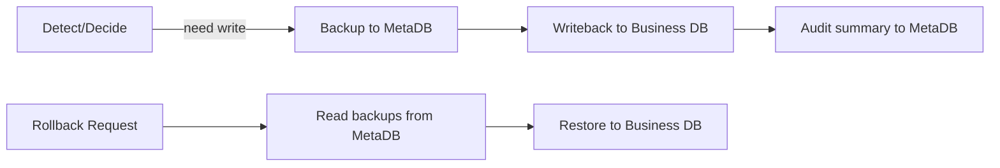
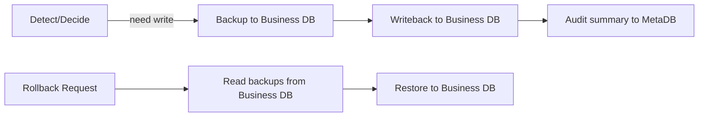
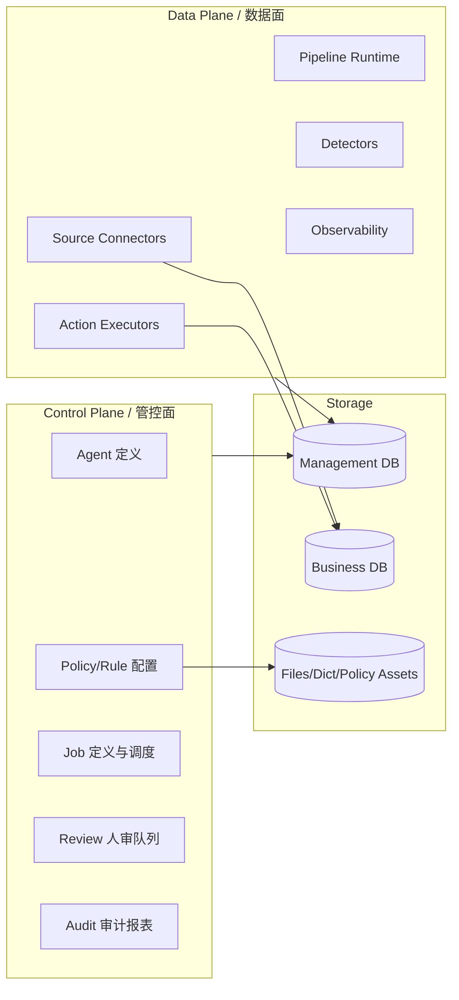
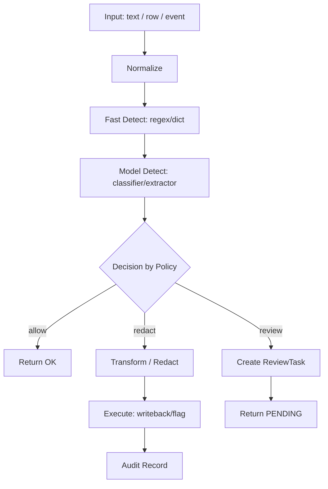

中文 | English (TBD)

# DataSentry 改造方案：可配置数据清理/敏感信息检测 Agent

> 目标：把当前偏“数据分析/NL2SQL”的 DataSentry，扩展为**可自由配置的多来源数据处理 Agent 平台**，重点支持高校论坛等场景的**敏感信息检测/脱敏/垃圾信息清理**，同时覆盖**实时输入**与**数据库存量批处理**两类模式。

> 说明：“只需要实时文本 + 数据库”两种数据来源；并且场景不限定论坛/高校，可用于任意业务表与字段。

## 开源与许可说明

- 本仓库为开源项目；根目录 `LICENSE` 为 Apache License 2.0（Apache-2.0）。
- 若你基于本方案二次开发并对外发布/分发，请遵循 Apache-2.0 的要求（例如保留许可与版权声明、标注修改等）。

## 0. 现状与可复用能力（基于当前仓库）

当前 `datasentry-management` 已具备以下可复用能力（对本次改造很有价值）：

- **Agent 管理与发布**：`/api/datasentry/agent` + `Agent` 实体（可作为“清理 Agent”的载体，后续补充类型/配置）。
- **多数据源管理与连接器**：`DatasourceService` + `connector/*`（可直接复用 DB 连接、表/字段元数据读取能力）。
- **可编排工作流引擎**：基于 `StateGraph` 的 `workflow/node/*` + `GraphServiceImpl`（可复用“节点化编排 + 流式输出 + 人审中断恢复”的机制）。
- **模型注册/Prompt 配置/向量检索**：`AiModelRegistry`、`PromptConfig`、`vectorstore`（用于分类、抽取、解释、RAG 增强）。

本次改造建议在不推翻现有架构的前提下，新增一条面向“数据治理/内容安全”的数据处理主链路，并把“清理任务”抽象成可配置 Pipeline。

## 1. 已确认需求（基于你的回复）

1. **数据来源**：只做两类输入
   - 在线实时文本（API 请求携带文本）
   - 数据库（已有 Datasource/connector 体系可复用）
2. **动作可配置**（核心）：敏感信息与垃圾信息都支持按策略选择
   - `DETECT_ONLY`：只检测返回
   - `SANITIZE_RETURN`：脱敏后返回，不写回
   - `SANITIZE_WRITEBACK`：脱敏并写回
   - `REVIEW_THEN_WRITEBACK`：人审通过后写回
   - `DELETE`：删除（建议优先实现“软删/打标”，硬删需严格备份与权限控制）
3. **写回允许更新原表**：但必须具备备份与回滚能力（至少行级字段旧值备份）。
4. **合规**：要做脱敏；系统内日志/审计默认不记录原文（或仅记录受控字段/加密存储）。
5. **性能**：面向大型企业交付（强调可扩展、可观测、可限流、可恢复），具体 SLA 未给定。
6. **业务表结构不固定**：不能假设固定字段；必须通过配置指定表、主键、目标字段、写回映射。
7. **场景不限**：不做论坛/高校专用绑定；所有“场景差异”通过 policy/job 配置表达。
8. **输出解释性**：你表示“不需要”；因此在线 API 默认只返回最小信息（结论/脱敏文本/必要的类别摘要），但系统内部仍建议保留可审计的 evidence（可开关）。

## 2. 关键设计决策（已定）

1. **备份放哪里**（写回/删除前的旧值）：
   - A. 放在 **Management DB（本项目 MetaDB）**：实现简单，跨数据源统一；缺点是备份量大时压力集中。
   - B. 放在 **业务数据源同库（Business DB）**：就近存储，便于同库回滚；缺点是需要在每个业务库建表，权限/DDL 成本更高。
2. **删除语义**：
   - A. 默认只做“软删/打标”（推荐）：例如更新 `status`/`is_deleted`/`risk_level` 字段（字段名由配置提供）。
   - B. 支持硬删：必须强制备份整行 + 二次确认 + 更严格权限。
3. **在线 API 是否允许写回业务库**（你已确认：两种都要，做成可配置）：
   - 默认：在线只返回结果/脱敏文本，业务系统自行落库（风险/耦合最小）
   - 可选：在线携带写回目标信息由 DataSentry 执行写回（必须强鉴权、限流、审计与回滚）
4. **“脱敏”的规则来源**（你已确认）：采用 A
   - 内置常见 PII（手机号/邮箱/身份证/银行卡等）+ 可配置扩展

## 2A. 备份与删除：两套企业级架构（供你评估）

### 2A.1 备份/回滚：MetaDB 集中式 vs 同库就近式

#### 方案 A：统一备份在 Management DB（MetaDB）

**核心思路**：写回/删除前把“旧值”写入 MetaDB；回滚从 MetaDB 读旧值再恢复到业务库。



**优点**
- 一套表结构覆盖所有数据源（MySQL/PG/Oracle/SQLServer 等），实现与运维成本最低。
- 权限集中：业务库仅需最小必要读写权限，备份数据在管控库统一治理。

**缺点**
- 备份量大时 MetaDB 压力集中（存储、IO、备份窗口）。
- 回滚链路更长（跨库读备份 + 写回业务库）。

#### 方案 B：备份在业务库同库（Business DB）

**核心思路**：每个数据源库内建备份表（或影子表），写回/删除前旧值落同库；回滚仅访问同库完成恢复。



**优点**
- 就近回滚，链路短、性能与稳定性更好。
- “备份不出库”更容易满足部分强合规要求。

**缺点**
- 需要在每个业务库做 DDL/授权与版本演进；异构数据库差异会增加实现成本。

#### 推荐（企业通用）：双模架构 + 配置化选择

你希望“对接大型企业项目”，建议实现为**双模可选**（按 job 或 datasource 维度配置）：

- `backup.storage = METADB | BUSINESS_DB`
- 默认 `METADB`（落地快、跨库统一）；对强合规/高吞吐数据源切到 `BUSINESS_DB`

实现上拆两层接口即可（后续可在代码中按 Spring Bean/SPI 注入）：

- `BackupStore`：`MetaDbBackupStore` / `BusinessDbBackupStore`
- `RollbackExecutor`：统一接口，内部按 `backup.storage` 选择读取端与恢复策略

### 2A.2 删除语义：软删优先 + 硬删受控

#### 方案 A：软删/打标为主（建议默认）

**核心思路**：不物理删除，通过配置“软删字段映射”实现业务态删除/隔离：

- 例：`status = 'DELETED'` 或 `is_deleted = 1` 或 `risk_level = 'SPAM'`
- 字段名与取值由 `writeback_mapping_json` 配置（适配任意表结构）

**优点**
- 可回滚简单，误判成本低。
- 更容易与业务侧“申诉/恢复”闭环对接。

#### 方案 B：支持硬删（高风险能力，建议强约束）

**硬删定义**：物理删除行（例如 `DELETE FROM table WHERE pk=...`），记录会从业务表中消失。

**建议约束（可配置，但建议给企业默认值）**
- 强制备份：硬删前必须先做“行级快照备份”（建议整行或至少包含业务必需回滚列）
- 强鉴权：硬删能力单独权限/开关
- 可选人审：按 policy/job/binding 配置为 `ALWAYS | ON_RISK | NEVER`（你已确认允许 `NEVER`，但建议默认 `ALWAYS`）
- 幂等/冲突检测：发现记录在写回/删除前已被其他系统改写，则中止或转人审

**落地建议**
- `writeback_mode = HARD_DELETE` 必须显式开启（默认关闭）
- 即使 `review_policy = NEVER`，也应至少强制：pre-change 备份 + 强鉴权 + allowlist（限定 datasource/table/where 范围）

## 3. 目标能力（需求拆解）

### 2.1 可配置 Agent：面向“来源 + 策略 + 动作”

一个“清理 Agent”需要可配置至少这三块：

- **来源（Source）**：实时输入 / 数据库表 / 爬虫抓取 / 消息队列……
- **策略（Policy）**：敏感信息类别、垃圾信息定义、阈值、白名单、字段范围、是否人审。
- **动作（Action）**：返回检测结果、返回脱敏文本、写回 DB（更新/软删/打标）、发事件通知等。

### 2.2 两种运行模式

- **在线（实时）模式**：给论坛发帖/回帖前进行检测/脱敏/拦截，接口必须稳定低延迟。
- **离线（批处理）模式**：对存量库做扫描与治理（可分批/可暂停/可恢复/可审计）。

## 4. 总体架构：Control Plane + Data Plane

建议将改造后的系统明确成两条“平面”：

- **控制面（Control Plane）**：配置、策略、任务定义、审批、人审队列、审计报表。
- **数据面（Data Plane）**：连接器读取数据 -> 执行清理 Pipeline -> 输出结果/写回。



### 为什么要分两平面

- 避免“把业务数据处理”与“配置管理/审批审计”耦合在一起，便于演进与权限控制。
- 数据面更容易横向扩展（批处理跑得动），控制面更强调一致性与审计。

## 5. 领域模型（建议新增/强化的核心对象）

### 4.1 Agent（清理 Agent）

建议在现有 `Agent` 基础上补充：

- `agent_type`：`ANALYSIS`（现有）/ `CLEANING`（新增）
- `agent_config`（JSON）：Pipeline 引用、默认 Policy、运行参数（阈值、模型选择、是否人审等）
- `version` + `published_version`：便于灰度与回滚

> 也可以不改 `Agent` 表，新增 `CleaningAgent` 表做 1:1 扩展；取决于你是否希望“一个 Agent 统一承载分析与清理”。

### 4.2 Policy / Rule（策略与规则）

建议按“策略集 -> 规则 -> 命中结果”拆分：

- `CleaningPolicy`：策略集（适用于某个场景/站点/表字段范围）
- `DetectionRule`：规则（regex/词典/模型分类/LLM 抽取），可组合成规则链
- `PolicyBinding`：策略绑定（绑定到 agent、绑定到 datasource/table/column、绑定到 API endpoint）

### 4.6 Allowlist（白名单）—— 误杀控制的关键机制

你强调“误杀是最大痛点”，因此白名单必须是**一等公民**，而不是简单的规则例外。建议把 Allowlist 设计成可分层、可追踪、可审计、可过期的策略资源。

**核心原则**

- **分层生效**：全局/租户/Agent/Policy/Rule/数据源/表/字段 都可挂白名单。
- **可过期**：支持 `ttl/expire_time`，避免“临时放行永久遗留”。
- **可审计**：记录创建人、原因、审批与生效范围。
- **可回溯**：对每次命中写入审计（至少写入“命中白名单”这一事实）。

**建议分类**

- **内容类 Allowlist**
  - 精确值（exact）
  - 前后缀/包含（contains/startsWith/endsWith）
  - 正则（regex）
  - 词典（dict）
- **实体类 Allowlist**
  - 业务 ID/工单号/设备号/学号等（指定字段生效）
  - 品牌/机构/专有名词（跨字段生效）
- **上下文 Allowlist**
  - 特定业务场景/来源（scene/source）
  - 特定字段（仅对某列生效）

**生效顺序（推荐）**

1. **Pre-check Allowlist**（在检测前拦截）：对明显白名单直接跳过检测/跳过部分规则。
2. **Post-check Allowlist**（在命中后过滤）：如果命中条目在 allowlist，则清除该条 finding。

> 建议：Pre-check 只用于“明确且安全的白名单”（如业务 ID 格式），Post-check 用于“语义白名单”（专有名词/人名/品牌等）。

**对规则/模型的作用方式**

- 对 regex/dict 规则：直接排除命中（速度快）
- 对模型/LLM：作为 `system/prompt` 的负样本/约束；或在后处理阶段过滤 findings

### 4.7 Allowlist 推荐表结构（示意）

> 表结构仅示意，具体可按你们权限体系微调。

- `cleaning_allowlist`
  - `id` PK
  - `name`
  - `type`（EXACT / REGEX / DICT / CONTAINS / PREFIX / SUFFIX）
  - `value`（值/表达式/词典引用）
  - `category`（PII/SPAM/... 可为空表示对所有类别生效）
  - `scope_type`（GLOBAL / TENANT / AGENT / POLICY / RULE / DATASOURCE / TABLE / COLUMN / SCENE）
  - `scope_id`（对应实体的 id；GLOBAL 可为空）
  - `field_name`（可选：仅对某列生效）
  - `enabled`
  - `expire_time`（可选）
  - `created_by` / `created_time`
  - `reason`（误杀说明/业务背景）
- `cleaning_allowlist_audit`
  - `id` PK
  - `allowlist_id`
  - `action`（CREATE/UPDATE/DELETE/EXPIRE/APPROVE/REJECT）
  - `actor_type` / `actor_id`
  - `created_time`

**UI/流程建议**

- Allowlist 新增默认走审批（可配置），尤其是 GLOBAL/AGENT 级别
- 批处理执行时输出“白名单命中统计”
- 线上接口可返回 `verdict=ALLOWLISTED`（可选），但默认不暴露具体白名单内容

**可观测指标（建议加入 Metrics）**

- `allowlist_hit_total`：白名单命中次数（按 scope/type/category 维度拆分）
- `allowlist_hit_ratio`：白名单命中率（命中白名单 / 总检测量）
- `false_positive_reduction`：误杀下降率（上线前后对比，可选离线统计）
- `allowlist_overrides_total`：白名单覆盖命中数量（用于评估是否“过度放行”）

### 4.3 Finding（命中结果）

统一描述命中信息，供在线/离线共用：

- `type`：PII_PHONE / PII_ID / PROFANITY / SPAM / AD / URL_PHISHING …
- `severity` / `score`
- `suggested_action`：REDACT / BLOCK / FLAG / DELETE / REVIEW
- `evidence`（内部使用）：规则名/模型版本/置信度（可通过开关决定是否返回给客户端）

### 4.4 Job / JobRun（批处理任务）

批处理需要可观测、可恢复：

- `CleaningJob`：定义（数据源、范围、过滤条件、策略、动作、并发/批大小）
- `CleaningJobRun`：一次运行实例（状态、进度、checkpoint、错误统计）
- `CleaningRecord`：每条数据的检测/清理结果（支持导出与审计）

### 4.5 ReviewTask（人审任务）

复用现有 Graph 的“interrupt before human feedback”思想，但在人审对象上从“Plan”扩展到“数据修复建议”：

- `ReviewTask`：包含原文（或脱敏展示）、命中列表、建议修改、差异对比、审批结论与操作者

## 6. Pipeline 运行时：可插拔的“检测-决策-执行”链路

### 5.1 Pipeline 步骤建议（通用）

一个通用清理 Pipeline 可以抽象为：

1. **Normalize**：文本清洗（去控制字符/统一编码/分句）
2. **Fast Detect**：规则/词典/正则快速命中（低成本，降低 LLM 压力）
3. **Model Detect**：分类/抽取（小模型/LLM），输出结构化 findings
4. **Decision**：根据 policy（阈值、人审开关、白名单）决定动作
5. **Transform**：脱敏/重写/打标
6. **Execute**：写回 DB/返回结果/发事件
7. **Audit**：落审计记录（必要时仅保存 hash/脱敏内容）



### 5.2 插件化扩展点（建议接口）

为实现“自由配置”，建议明确以下 SPI（可 Spring Bean 注册 + DB 配置引用）：

- `SourceConnector`：从不同来源读取数据（inline / DB / HTTP / MQ / crawler）
- `Detector`：输出 `List<Finding>`（regex、词典、模型、LLM）
- `PolicyResolver`：根据 agent/datasource/table/field/endpoint 选择策略集
- `ActionExecutor`：执行动作（返回/写回/发事件/创建人审）
- `Pipeline`：把上述组件按 DAG/链路编排（可复用现有 `StateGraph`）

## 7. 数据源接入设计（你已确认只做两类）

### 6.1 在线实时输入（推荐先做 MVP）

新增面向“内容审核/脱敏”的 API（示例）：

- `POST /api/datasentry/cleaning/{agentId}/check`
  - 入参：`text` + 可选元数据（userId、scene、ip、device、lang）
  - 出参：`verdict`（ALLOW/BLOCK/REVIEW）+ `findings`
- `POST /api/datasentry/cleaning/{agentId}/sanitize`
  - 出参：`sanitizedText` + `findings` + `diff`

考虑你要求“可配置自动写回/人审后写回/删除”，在线接口可以支持两种形态：

- **默认**：在线只返回 verdict/sanitizedText；由业务系统落库（风险与耦合最小）
- **可选增强**：在线携带 `writebackTarget`（datasourceId/table/pk/columns），由 DataSentry 写回（必须强鉴权 + 审计 + 回滚）

### 6.2 数据库批处理（存量治理）

复用现有 Datasource/connector：读取表与字段，按分页/游标扫描（避免全表锁）。

关键点：

- 默认 **dry-run**：只生成 `CleaningRecord`，不写回。
- 写回需要：
  - 明确主键（用于幂等更新）
  - 明确字段级动作（只改 `content` 还是也改 `title`）
  - 可选“先写 shadow column/table，再切换”策略

## 7. 与现有代码的映射（建议新增包/模块边界）

建议在 `datasentry-management/src/main/java/com/touhouqing/datasentry` 下新增：

- `cleaning/controller/*`：在线检测/脱敏/任务管理 API
- `cleaning/domain/*`：Policy、Rule、Finding、Job 等领域对象
- `cleaning/service/*`：Pipeline 执行、detector/connector/action 注册与编排
- `cleaning/repository/*`：MyBatis mapper + entity（如采用独立表）
- `cleaning/workflow/*`：基于 `StateGraph` 的 CleaningGraph（复用“可中断人审”）

并尽量复用现有：

- `service/datasource/*` + `connector/*`：DB 读取与元信息
- `service/llm/*` + `AiModelRegistry`：模型调用与选择
- `PromptConfig`：把“分类/抽取/改写”的 prompt 当作可配置资源

## 8. 安全与合规（必须纳入架构）

敏感信息治理系统的核心风险不是“做不出来”，而是“误删/泄漏/不可追溯”。建议默认开启：

- **最小化外发**：先规则命中再决定是否调用 LLM；必要时先做局部脱敏再送模型。
- **审计留痕**：每次写回必须可追溯到 `job_run_id`/`review_task_id`/操作者。
- **权限分级**：扫描、下载报告、写回、回滚分开授权。
- **可回滚**：至少支持“写回前备份旧值”（行级备份表或审计表存旧值）。
- **可解释**：返回/存储 findings（命中类型、证据、置信度），便于申诉与调参。

### 8.1 外部模型（LLM/Embedding）出站策略（已定）

你已确认：

- 允许使用外部模型
- 允许**发送原文**给外部模型（不做出站脱敏）

因此建议把“出站策略”做成 policy/job 级配置（默认值可由发行版决定）：

- `llm_outbound.enabled = true|false`
- `llm_outbound.mode = ORIGINAL | REDACTED | MINIMIZED`
  - `ORIGINAL`：发送原文（你选择）
  - `REDACTED`：先脱敏再发送
  - `MINIMIZED`：仅发送必要片段（例如命中附近窗口/摘要）

> 注意：系统内部仍应坚持“日志/审计不落原文”，避免二次泄漏；备份/回滚数据按 11.6 加密策略处理。

## 9. 分阶段改造路线图（建议）

### Phase 1：在线检测/脱敏 MVP（最快产出）

- 新增 `cleaning` API：`check/sanitize`
- 实现 2~3 类 Detector：
  - regex/词典（手机号/邮箱/学号/身份证等）
  - 轻量分类模型/LLM（SPAM/辱骂/广告）
- 输出统一 `findings`，并支持 `sanitizedText`（基于 spans 做替换）

### Phase 2：批处理扫描（只读 + 报告）

- 新增 `CleaningJob`/`JobRun`/`CleaningRecord`
- 支持按 datasource/table/where 条件分页扫描
- 产出报告：命中分布、top 规则、风险等级、示例（脱敏后）

### Phase 3：批处理写回（可控落库）

- 支持 dry-run -> 人审抽样/全量审批 -> 执行写回
- 支持备份与回滚策略

### Phase 4：更多来源与更强治理

- 爬虫/队列接入
- 白名单/申诉闭环
- 策略版本管理、灰度发布、多租户隔离

## 10. 风险点与对策（提前设计）

- 误判导致误删：默认 dry-run + 人审；写回必须可回滚。
- LLM 不稳定：关键决策用规则/阈值兜底；LLM 只做补充证据或抽取。
- 性能与成本：先 fast detect，命中才进入模型；批处理可并发但要限流。
- 数据泄漏：外发前脱敏；prompt/日志禁止输出原文；权限与审计。

---

## 11. 表结构草案（Management DB / MetaDB 版）

> 如果你选择“备份放在业务库”，本节的 `cleaning_backup_*` 需要迁移到 Business DB 对应的数据源里。

### 11.1 Policy/Rule

- `cleaning_policy`
  - `id` PK
  - `name`
  - `description`
  - `enabled` (0/1)
  - `default_action`（DETECT_ONLY/SANITIZE_RETURN/SANITIZE_WRITEBACK/REVIEW_THEN_WRITEBACK/DELETE）
  - `config_json`（阈值、白名单、是否允许外发模型等）
  - `created_time` / `updated_time`
- `cleaning_rule`
  - `id` PK
  - `name`
  - `rule_type`（REGEX/DICT/MODEL/LLM）
  - `category`（PII/SPAM/ABUSE/...）
  - `severity`
  - `enabled`
  - `config_json`（regex、词典引用、promptId、模型选择等）
  - `created_time` / `updated_time`
- `cleaning_policy_rule`
  - `policy_id`
  - `rule_id`
  - `priority`

### 11.2 Binding（把策略绑定到“在线/批处理/特定表字段”）

- `cleaning_binding`
  - `id` PK
  - `agent_id`（复用现有 Agent）
  - `binding_type`（ONLINE_TEXT / DB_TABLE）
  - `datasource_id`（nullable；DB_TABLE 时必填）
  - `table_name`（nullable；DB_TABLE 时必填）
  - `pk_columns`（JSON 数组，DB_TABLE 必填，例如 ["id"] 或 ["tenant_id","id"]）
  - `target_columns`（JSON 数组，需要检测/脱敏的列，例如 ["content","title"]）
  - `where_sql`（可选，仅批处理时用于限定范围；注意 SQL 注入与权限）
  - `policy_id`
  - `enabled`

### 11.3 Job/Run/Record（批处理）

- `cleaning_job`
  - `id` PK
  - `agent_id`
  - `datasource_id`
  - `table_name`
  - `pk_columns`（JSON）
  - `target_columns`（JSON）
  - `where_sql`（可选）
  - `policy_id`
  - `mode`（DRY_RUN / WRITEBACK）
  - `writeback_mode`（UPDATE / SOFT_DELETE / HARD_DELETE）
  - `review_policy`（ALWAYS / ON_RISK / NEVER）
  - `backup_policy_json`（见下文 11.6）
  - `writeback_mapping_json`（字段映射：例如把 `content` 更新为 `sanitized_content`）
  - `batch_size` / `concurrency` / `rate_limit`
  - `enabled`
  - `created_time` / `updated_time`
- `cleaning_job_run`
  - `id` PK
  - `job_id`
  - `status`（RUNNING/SUCCEEDED/FAILED/CANCELED/PAUSED）
  - `lease_owner`（执行者实例标识，如 hostname/podName）
  - `lease_until`（租约到期时间，用于多实例抢占与故障转移）
  - `heartbeat_time`（心跳时间）
  - `attempt`（重试次数）
  - `version`（乐观锁，可选）
  - `checkpoint_json`（游标/最后 pk 等）
  - `total_scanned` / `total_flagged` / `total_written` / `total_failed`
  - `started_time` / `ended_time`
- `cleaning_record`
  - `id` PK
  - `job_run_id`（nullable：在线模式可为空）
  - `datasource_id`（nullable：在线模式可为空）
  - `table_name`（nullable）
  - `pk_json`（JSON：主键值映射，如 {"id":123} 或 {"tenant_id":1,"id":123}）
  - `column_name`（命中发生在哪个列）
  - `verdict`（ALLOW/BLOCK/REVIEW/REDACTED/DELETED）
  - `action_taken`（与 verdict 分开，记录实际执行动作）
  - `sanitized_preview`（可选：脱敏后片段/摘要，不存原文）
  - `evidence_json`（可选：规则/模型摘要，不含原文）
  - `created_time`

### 11.4 Backup（写回/删除前的回滚依据）

- `cleaning_backup_record`
  - `id` PK
  - `job_run_id`
  - `datasource_id`
  - `table_name`
  - `pk_json`
  - `pk_hash`（对 pk_json 做 hash，便于索引与唯一约束）
  - `encryption_provider`（local/kms/...）
  - `key_version`（主密钥/KMS key 版本）
  - `before_row_ciphertext`（加密后的旧值快照；若 encrypt=false 可落 before_row_json）
  - `before_row_json`（可选：仅用于 encrypt=false 或调试环境；生产建议禁用）
  - `created_time`

### 11.5 Review（人审）

- `cleaning_review_task`
  - `id` PK
  - `job_run_id`（nullable：在线也可能进入人审）
  - `datasource_id` / `table_name` / `pk_json`（nullable）
  - `proposed_action`（WRITEBACK/DELETE/ALLOW）
  - `before_preview`（脱敏展示）
  - `after_preview`（脱敏后预览或修订建议）
  - `status`（PENDING/APPROVED/REJECTED）
  - `reviewer` / `review_time` / `comment`

### 11.6 BackupPolicy（备份策略模型：行级快照 + 可选定时备份）

你希望“硬删/软删/是否人审/备份策略”都能按对接表配置；因此建议把备份从“固定行为”升级成可配置策略（但仍保留安全下限）。

**关键原则（建议写入产品约束）**
- 只要发生 `UPDATE` 或 `HARD_DELETE`，必须先做 **pre-change 行级快照**，否则无法提供可靠回滚。
- “定时备份”可以作为补充（合规/留档/灾备），但不应替代 pre-change 快照。

**推荐方案（企业通用）**
- **Pre-change 行级快照（必须）**：用于精确回滚“本次清理动作”。
- **Scheduled 行级快照（可选）**：对高风险表/硬删表定时抽取符合条件的数据做快照，用于：
  - 做“硬删前的额外保护”（防止误配置/漏备份/跨系统误操作）
  - 形成合规留档（按 retention 管理）
- **数据库原生备份（可选对接）**：用于全库灾备（DR）；不建议把它作为自动回滚的唯一依据（成本高、恢复粒度粗、跨库复杂）。

建议 `backup_policy_json` 支持如下结构（示例）：

```json
{
  "storage": "METADB",
  "preChange": {
    "enabled": true,
    "scope": "CHANGED_COLUMNS",
    "encrypt": true,
    "compress": true,
    "retentionDays": 30
  },
  "scheduled": {
    "enabled": false,
    "cron": "0 0 2 * * ?",
    "mode": "SNAPSHOT_MATCHING_ROWS",
    "whereSql": "status = 'PUBLISHED'",
    "retentionDays": 7
  }
}
```

字段解释（建议）：
- `storage`：`METADB | BUSINESS_DB`（你已选择双模配置化，可按 job/datasource/binding 覆盖）
- `preChange.scope`：`CHANGED_COLUMNS | FULL_ROW`
- `scheduled.mode`：可先只实现 `SNAPSHOT_MATCHING_ROWS`（将符合条件的行做快照落备份表/备份记录）

**关于 retentionDays（你提到“天数应该可选”）**
- 设计上支持按 `job` 或 `binding` 配置 `retentionDays`；并允许按表风险等级给默认值。
- 推荐默认值（可调整）：
  - `preChange.retentionDays = 30`（常见企业回滚窗口）
  - `scheduled.retentionDays = 7`（用于额外保护/抽样留档）
  - 当 `writeback_mode = HARD_DELETE` 时建议提高（例如 90/180），或强制走人审。

**备份数据如何更合理（安全与成本平衡，企业推荐默认）**
- 默认 `encrypt=true`（尤其是 `storage=METADB` 时）：备份里本质仍可能包含 PII/敏感内容，即使系统“对外脱敏”，备份也不应明文落库。
- 默认 `scope=CHANGED_COLUMNS`：只存被改动列 + 必要的业务状态列，降低泄漏面与存储成本；对硬删可切到 `FULL_ROW`。
- 加密建议采用“信封加密（Envelope Encryption）”：
  - 数据用随机 DEK（对称密钥）加密，DEK 再用 KEK/KMS 包裹存储；支持密钥轮换与最小暴露。
  - 如果暂时没有企业 KMS，也可先落地为“应用层主密钥 + 定期轮换”，但建议预留 KMS 接口。
- 访问控制与审计：
  - 回滚/解密能力单独权限；所有解密与回滚操作必须写审计（操作者、工单/原因、范围）。
  - UI/接口默认不返回备份明文；仅在回滚执行过程中于服务端短暂解密使用。

**开源项目落地建议（避免厂商锁定，默认可用）**
- 以插件化方式提供 `EncryptionProvider`（或类似 SPI），内置两类实现：
  - `local`（默认开箱即用）：使用 JCE `AES-256-GCM` 做数据加密；“主密钥”从环境变量/启动参数读取（例如 `DATASENTRY_BACKUP_MASTER_KEY`），严禁写入代码仓库与默认配置文件。
  - `kms`（可选）：预留接口给企业用户对接任意 KMS（阿里云 KMS、AWS KMS、自建 Vault 等），开源仓库只提供接口与示例，不强依赖某家云。
- 轮换策略：
  - 通过 `keyId`/`keyVersion` 字段标记每条备份使用的 KEK/主密钥版本。
  - 提供“后台再加密”工具/任务（re-encrypt）以支持密钥轮换（对开源项目可作为可选能力，先文档化后实现）。

## 12. API 定义草案（在线 + 批处理 + 回滚）

> 你不需要“命中 span 位置”等解释性输出；因此下面响应默认最小化。审计/排障需要的 evidence 保存在 MetaDB（可控开关）。

### 12.1 在线检测（不写回）

- `POST /api/datasentry/cleaning/{agentId}/check`
  - req
    - `text` string
    - `scene` string (optional)
    - `policyId` number (optional; 不填则走 binding/default)
  - resp
    - `verdict`: `ALLOW | BLOCK | REVIEW`
    - `categories`: string[]（例如 ["PII","SPAM"]，可选）

### 12.2 在线脱敏（不写回）

- `POST /api/datasentry/cleaning/{agentId}/sanitize`
  - req: 同上
  - resp
    - `verdict`: `ALLOW | REDACTED | REVIEW | BLOCK`
    - `sanitizedText`: string（当 verdict=REDACTED/ALLOW 时可返回）

### 12.3 在线“可选写回”（你要求两种都可配置）

- `POST /api/datasentry/cleaning/{agentId}/sanitize`
  - req 增加可选 `writebackTarget`（仅当你要在线写回时填写）
    - `datasourceId`
    - `table`
    - `pk`（JSON：主键名 -> 值）
    - `columns`（要写回的列名列表，或映射）
  - resp 增加可选 `writebackStatus`
    - `writebackStatus`: `SKIPPED | SUCCEEDED | FAILED`

> 安全建议：在线写回默认关闭；需要在 Agent/Binding 层显式开启 allowlist（允许写回的 datasource/table/column）。

### 12.4 批处理任务

- `POST /api/datasentry/cleaning/jobs`
  - req：创建 job（datasourceId/table/pkColumns/targetColumns/policyId/mode/writebackMode/reviewPolicy/backupPolicy...）
  - resp：job id
- `POST /api/datasentry/cleaning/jobs/{jobId}/runs`
  - resp：jobRun id
- `POST /api/datasentry/cleaning/job-runs/{runId}/pause` / `resume` / `cancel`
- `GET /api/datasentry/cleaning/job-runs/{runId}`
  - resp：进度、统计、错误摘要

### 12.5 回滚

- `POST /api/datasentry/cleaning/job-runs/{runId}/rollback`
  - 行为：基于 `cleaning_backup_record` 逐条恢复（需要幂等与冲突检测：如发现已被其他系统改写则中止/转人审）

## 13. CleaningGraph 节点设计（复用现有 StateGraph 中断/恢复思想）

为兼容“可配置动作 + 人审 + 写回/回滚”，建议新增 `CleaningGraph`，核心节点如下：

1. `InputBuildNode`：标准化输入（在线 text / DB row -> 统一 Input）
2. `PolicyResolveNode`：根据 agent + binding 解析 policy/rules
3. `FastDetectNode`：regex/dict 快速检测
4. `ModelDetectNode`：模型/LLM 检测（可选，按策略触发；外发前先做最小化脱敏）
5. `DecisionNode`：产出 verdict + action plan
6. `BackupNode`：若需要写回/删除则先备份（落 `cleaning_backup_record`）
7. `HumanReviewNode`：若 action=REVIEW_THEN_WRITEBACK，则 `interruptBefore` 等待审批
8. `WritebackNode`：UPDATE/SOFT_DELETE/HARD_DELETE
9. `AuditNode`：落 `cleaning_record`

> `GraphServiceImpl` 的流式输出、人审中断恢复机制可以直接复用；区别在于中断对象从“规划 plan”变为“数据修复建议”。

## 14. 下一步

你已确认：

- 在线“只返回”与“写回”两种都要（做成可配置，默认只返回）
- 脱敏规则采用“内置常见 PII + 可配置扩展”
- 软删/打标默认采用：通过配置更新业务表字段（最通用）
- 备份存储采用“双模配置化”（MetaDB/同库可选）
- 备份加密采用“开源默认 local + 可插拔 kms provider”
- 硬删允许配置为“无需人审”（`review_policy=NEVER`），但硬删始终强制 pre-change 备份与强鉴权
- 外部模型允许发送原文（`llm_outbound.mode=ORIGINAL`）
- 鉴权/权限：Agent API Key +（可选）管理端登录；写回/硬删/回滚/解密分权
- 密钥缺失：允许启动，但禁止写回/硬删/回滚，仅允许 `DETECT_ONLY`
- 写回冲突：跳过 + 记录 `cleaning_record` +（如开启人审）转 `review_task`
- 批处理分布式：MetaDB 领取 job-run + 租约续租（不引入外部中间件）
- 过滤条件：默认结构化过滤；如保留 `where_sql`，仅管理员可用且需 allowlist/只读校验/参数化

我会据此把这份文档再定稿，并补充：

- 更具体的字段定义（含索引、唯一约束、状态机）
- 批处理扫描算法（按 pk 游标/分页策略）与幂等写回策略
- 权限模型（写回/删除/回滚的权限分离）
- 性能与可观测（限流、熔断、trace、失败重试/死信记录）

---

## 15. 可直接开工的实现细节（定稿）

本节把“能写代码”的关键算法与边界条件说清楚：分布式调度、扫描分页、幂等写回、冲突处理、结构化过滤、状态机。

### 15.1 任务状态机（JobRun）

建议 `cleaning_job_run.status` 状态机：

- `QUEUED`：已创建，等待领取
- `RUNNING`：已领取并执行中（必须持有租约）
- `PAUSED`：暂停（保留 checkpoint，可恢复）
- `CANCELED`：取消（停止进一步处理）
- `SUCCEEDED`：成功结束
- `FAILED`：失败结束（可手动/自动重试创建新的 run）

并建议补充字段（见 11.3）用于多实例协调：`lease_owner/lease_until/heartbeat_time/attempt`。

### 15.2 分布式执行：MetaDB 租约领取 + 心跳续租（无外部中间件）

你已选择“MetaDB 领取 + 租约续租”。推荐协议如下：

**领取（Acquire）**
- Worker 周期性查询可领取的 run：`status in (QUEUED,RUNNING)` 且 `lease_until` 为空或已过期
- 使用单条原子更新抢占（伪 SQL）：
  - `UPDATE cleaning_job_run SET lease_owner=?, lease_until=now()+lease, heartbeat_time=now(), status='RUNNING'`
  - `WHERE id=? AND (lease_until IS NULL OR lease_until < now()) AND status IN ('QUEUED','RUNNING')`
- 更新成功（affected_rows=1）即获得租约，开始执行；失败则换下一个 run。

**续租（Renew）**
- 执行期间每 `lease/3`（例如 10s）更新 `lease_until` 与 `heartbeat_time`
- 若续租失败（例如被其他实例抢占或 run 被 PAUSED/CANCELED），当前 worker 必须立刻停止。

**故障转移**
- 实例宕机后不再续租，租约自然过期；其他实例可抢占继续执行（从 checkpoint 恢复）。

> 说明：允许抢占 `RUNNING` 且 lease 过期的 run，是为了从“宕机/网络抖动”中恢复。只要写回幂等（见 15.4）即可安全重跑。

### 15.3 数据库扫描：要求主键 + Keyset Pagination + Checkpoint

因为业务表结构不固定，批处理必须依赖配置提供：

- `pk_columns`：主键列（可复合）
- `target_columns`：需要检测/脱敏/打标的列
- `filter`：结构化过滤（优先）或管理员 `where_sql`（受控）

**扫描排序**
- 强制 `ORDER BY pk_columns`（稳定顺序），避免分页重复/遗漏。

**分页方式**
- 优先 Keyset 分页（推荐，适合大表）：
  - 单主键：`WHERE pk > :lastPk ORDER BY pk LIMIT :batch`
  - 复合主键：用“字典序”条件（不同数据库写法不同；必要时可退化为拼接比较或分段条件）。
- 不推荐 OFFSET 分页（大表性能差且易错），仅用于无主键或小表 debug（但本方案默认要求 pk）。

**Checkpoint 结构（checkpoint_json）**

建议最少包含：

- `lastPk`：上次处理到的主键值（单 pk 直接值；复合 pk 用 JSON map）
- `scanned`/`written`/`failed`：统计
- `updatedAt`：最后更新时间

### 15.4 写回幂等：Backup 去重 + 写回“只做一次”语义

多实例 + 租约抢占意味着同一行可能被重复处理；必须幂等。

建议以“写回前备份”为幂等锚点：

- 对每条待写回（UPDATE/HARD_DELETE），先写 `cleaning_backup_record`
- 给 `cleaning_backup_record` 添加“业务唯一键”（概念）：
  - `(job_run_id, datasource_id, table_name, pk_hash)` 唯一

执行流程（单行）：

1. 计算 `pk_hash`（如 `SHA-256` of normalized pk_json）
2. `INSERT` backup（若违反唯一键说明该行已处理过写回流程）
3. 若 backup 已存在：
   - 直接跳过 writeback（或仅补齐审计记录），避免重复更新/重复删除
4. 执行 writeback（UPDATE/SOFT_DELETE/HARD_DELETE）
5. 写 `cleaning_record`

> 注意：如果你希望“同一行在同一个 run 内可被多次更新”（例如多列分阶段处理），则需要把唯一键扩展为 `(job_run_id, datasource_id, table_name, pk_hash, action_seq)`；但建议 MVP 先保证“每行每 run 最多一次写回”。

### 15.5 写回冲突检测（你已选择：跳过 + 记录 + 可转人审）

冲突的典型原因：业务系统在我们扫描后又修改了该行。

建议实现“轻量冲突检测”：

- 备份时记录“旧值指纹”（hash），例如对 `target_columns + soft_delete_columns` 做 hash（不存原文）
- 写回前再次读取当前值并对比指纹
- 不一致则判定冲突：
  - `SKIP`：跳过写回
  - 写 `cleaning_record` 标记 `CONFLICT_SKIPPED`
  - 若策略启用人审，则创建 `cleaning_review_task`（携带脱敏后的 before/after 预览）

### 15.6 写回字段类型校验与长度保护（SANITIZE_WRITEBACK）

在 `SANITIZE_WRITEBACK` 执行时，**最常见的生产事故**是：脱敏后的文本超过字段长度或类型不匹配，导致写回失败或截断。

**建议机制**

- **字段元信息缓存**：通过 `DatasourceService` 读取列类型/长度（`VARCHAR(255)`/`TEXT`/`NVARCHAR` 等），缓存到 MetaDB（设置 TTL）。
- **写回前校验**：
  - 字符串字段：校验“字符长度”（注意多字节字符，建议按字符数而非字节数）
  - 数字/日期字段：禁止写入非类型值（脱敏动作应只作用于文本类字段）
- **长度保护策略（可配置）**：
  - `REJECT`：超长则拒绝写回，记录 `cleaning_record` 错误
  - `TRUNCATE`：按字段长度截断（需审计记录 `TRUNCATED`）
  - `REDACT_FALLBACK`：用固定占位符替代（例如 `***REDACTED***`），保证长度可控
- **回滚保障**：无论何种策略，写回前依然要做 pre-change 备份

**推荐默认**

- 线上/生产：`REJECT`（保守，避免意外截断）
- 低风险场景：可选 `TRUNCATE`，但必须写审计

### 15.7 结构化过滤（默认）与 where_sql（管理员受控）

为避免 SQL 注入与越权，建议默认只支持结构化过滤，后端生成参数化 SQL。

结构化过滤建议模型（示例）：

```json
{
  "op": "AND",
  "conditions": [
    { "field": "status", "operator": "EQ", "value": "PUBLISHED" },
    { "field": "created_at", "operator": "GTE", "value": "2026-01-01" }
  ]
}
```

落地规则：

- `field` 必须在 allowlist（由 binding/job 明确允许的过滤列）
- `operator` 白名单（EQ/IN/LIKE/GTE/LTE/BETWEEN）
- 值必须参数化绑定

`where_sql` 若保留：

- 仅管理员可用
- 只读校验与 allowlist（至少限制只包含允许的列/函数；禁止 `;`、`union`、`delete/update/insert` 等）
- 仍需参数化（建议仅允许 `?` 占位并由后端提供参数）

---

## 16. 安全治理定稿：鉴权/RBAC/审计/密钥

### 16.1 鉴权与权限分权（开源默认 + 可选管理端登录）

你已确认：`Agent API Key +（可选）管理端登录`，并对关键动作分权。

建议拆两类调用面：

- **在线内容接口**：以 `Agent API Key` 为主（调用方多为业务系统）
- **管控接口（创建 job、启动 run、回滚、解密）**：走管理端登录（开源版可先提供最小实现）

建议权限点（示例）：

- `CLEANING_READ`：查看配置与报告
- `CLEANING_RUN`：启动/暂停/恢复 job-run
- `CLEANING_WRITEBACK`：允许 UPDATE/SOFT_DELETE
- `CLEANING_HARD_DELETE`：允许 HARD_DELETE
- `CLEANING_ROLLBACK`：允许回滚
- `CLEANING_DECRYPT`：允许解密备份（通常仅回滚执行路径需要）
- `CLEANING_ADMIN`：管理策略/绑定/全局设置

### 16.2 备份主密钥缺失时的系统行为（已定）

你已确认：允许启动，但禁止写回/硬删/回滚，仅允许 `DETECT_ONLY`。

因此建议“守护规则”：

- 当 `backup_policy.preChange.encrypt=true` 且未配置主密钥：
  - 在线接口：强制降级为 `DETECT_ONLY`
  - 批处理：允许 DRY_RUN，拒绝 WRITEBACK/HARD_DELETE/ROLLBACK

### 16.3 审计事件（开源默认建议）

审计的目标是“可追溯、可还原动作链”，但避免落原文。

建议至少记录：

- 触发者：`actor_type`（API_KEY/ADMIN_USER/SYSTEM）+ `actor_id`
- 对象：`agent_id`、`job_id`、`job_run_id`、`datasource_id`、`table_name`、`pk_hash`
- 动作：`action`（DETECT/SANITIZE/WRITEBACK/SOFT_DELETE/HARD_DELETE/ROLLBACK/DECRYPT）
- 结果：`status`、`error_code`、`error_message`（不含敏感数据）
- 时间：`created_time`

---

## 17. 运维与性能（开工清单）

### 17.1 并发/限流（每数据源维度）

- `concurrency`：每个 job 的并发 worker 数（建议默认 1~4，视数据源而定）
- `rate_limit`：每秒处理行数/写回次数上限（保护业务库）
- 写回与扫描分离：扫描可更快，写回要更保守并限流

### 17.1A 自适应限流（Adaptive Throttling）

静态 `rate_limit` 在企业生产环境里往往不够安全，建议引入自适应限流：

- **输入信号**（可配置）
  - DB 连接池等待时间/超时率
  - 查询 P95/P99 延迟
  - 锁等待/死锁计数
  - 业务自定义健康指标（可选 webhook）
- **控制策略**
  - `AIMD`（Additive Increase / Multiplicative Decrease）：健康时逐步加速，出现异常时快速降速
  - `min/max` 限制：`rate_limit_min` ~ `rate_limit_max`
  - `cooldown`：降速后冷却窗口，避免抖动

> 自适应限流建议做成可选模块；默认仍保留静态限流以保证开箱可用。

### 17.2 重试与失败恢复

- 对“可重试错误”（网络抖动、连接超时）按指数退避重试
- 对“不可重试错误”（SQL 语法、权限不足）快速失败并标记 run 为 FAILED
- 逐行失败不应拖垮全局：记录到 `cleaning_record` 的 error 字段（或单独 error 表），继续处理后续行

### 17.3 可观测（建议开源默认）

- 指标（Micrometer）：扫描速率、写回速率、失败率、租约续租失败次数、队列长度
- 日志：必须带上 `job_run_id`、`datasource_id`、`table_name`、`pk_hash`（不要打印原文）
- Trace（可选）：关键链路（在线 check/sanitize、批处理 writeback/rollback）

### 17.4 最小开工顺序（推荐）

1. MetaDB 表与 MyBatis Mapper（policy/binding/job/job_run/record/backup/review）
2. JobRun 领取与租约续租
3. DB 扫描 + checkpoint（先单主键，复合主键后续增强）
4. pre-change 备份（local 加密）
5. writeback（UPDATE + SOFT_DELETE），冲突检测与跳过策略
6. review_task 创建与审批后续执行
7. HARD_DELETE（在已有备份/审计/权限基础上开放）

### 17.5 批处理扫描的“热点与性能隔离”（大型企业必备）

大型生产库上直接全量扫描容易引发热点与性能抖动，建议提供以下隔离策略（可配置）：

- **限速与窗口**：`rate_limit` + `scan_window`（仅在业务低峰时段扫描）
- **分片扫描**：按主键范围/分区/时间分片，避免长时间锁定热点区域
- **只读副本优先**：优先从只读库/从库读取（写回仍走主库）
- **温和查询**：避免 `SELECT *`，仅取 `pk + target_columns`；使用覆盖索引
- **失败降级**：检测到慢查询/锁等待超标时，自动降低扫描速率或暂停
- **热表白名单**：对核心业务表设置更严格的并发与速率上限

> 这些策略可通过 `job` 级参数控制，也可做成“全局默认 + job 覆盖”的两级配置。

---

## 18. 调试与模拟能力（Playground / Simulation）

企业管理员在配置复杂正则、Prompt、白名单时需要“沙箱调试”，否则即使 dry-run 也要跑 job，成本高且风险大。

**建议能力**

- **Playground API**
  - `POST /api/datasentry/cleaning/playground/check`
  - `POST /api/datasentry/cleaning/playground/sanitize`
  - 入参允许携带：`policyId` / `rules` / `allowlist` / `promptId` / `text`
  - 支持 “仅本次请求临时覆盖” 参数，不落库
- **Simulation Mode**
  - 以“固定样本集”对策略做批量评估（10~100 条）
  - 输出命中率、白名单覆盖率、误杀样本（脱敏后）

**安全建议**
- Playground 默认只对管理员可用
- 不写入 `cleaning_record`（或写到独立的 `simulation_record`）
- 对外部 LLM 出站仍走相同策略（可配置）

---

## 19. 预置策略模板库（Template Library）

为降低企业使用门槛，提供“开箱即用”的策略模板：

- **基础 PII**：手机号、邮箱、身份证、银行卡
- **业务常见**：工单号/订单号/设备号/学生学号（示例模板）
- **内容治理**：涉黄/涉政/辱骂/广告（词典 + 轻量模型）

**实现建议**

- 以 `template` 形式存储（JSON），首次初始化时可一键导入
- 模板应可复制为用户自定义 Policy（避免直接修改内置模板）

---

## 20. 通知与告警通道（Notification Channels）

审计与 job 状态不足以满足“主动触达”，建议补充通知通道。

**配置建议**
- 在 `cleaning_job` 或 `cleaning_policy` 增加 `notification_config`

**通道**
- Webhook
- Email
- Slack/钉钉/飞书（通过 webhook 实现）

**触发条件（示例）**
- Job 完成/失败/暂停
- 发现高危敏感信息（如私钥/身份证/银行卡）达到阈值
- 写回失败率超过阈值

---

## 21. 合规补充：备份的“被遗忘权”（TTL & Purge）

仅有 `retentionDays` 还不够，GDPR/本地法规可能要求“被遗忘权”。

**建议机制**

- 提供 `purge` API：按 `pk_hash` / `user_id` / 业务字段范围清理备份与审计记录
- 在 `backup_policy_json` 中支持 `purge_policy`：
  - `enabled`
  - `purge_after_days`
  - `purge_scope`（BACKUP_ONLY / BACKUP_AND_AUDIT）
- 清理时做审计：谁发起、范围、执行结果

> 注意：如果备份使用加密密钥轮换，可通过“销毁密钥”实现批量不可逆删除（Crypto Erasure），适合作为大规模清理策略。
