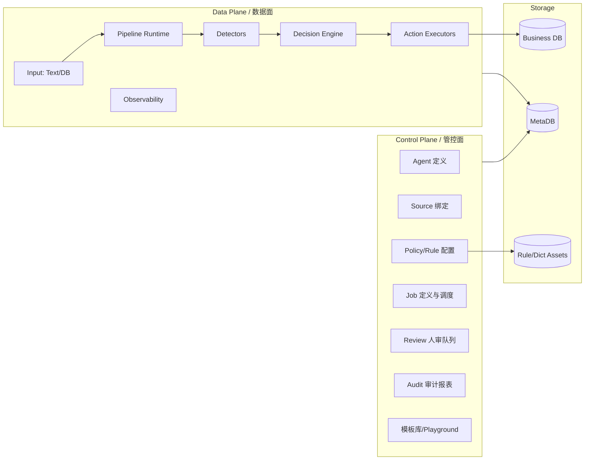

````中文 | English (TBD)

# DataSentry 数据清理/内容安全架构设计（实施版）

> 目的：在不推翻现有 DataSentry 架构的前提下，新增一条“数据治理/内容安全”主链路，将清理任务抽象为可配置 Pipeline，覆盖 **实时文本** 与 **数据库存量** 两类输入。
> 参考：`docs/AGENT_DATA_CLEANING_REFACTOR.md`

## 0. 范围与原则

### 0.1 覆盖范围
- **输入来源**：仅支持 **实时文本** 与 **数据库**。
- **问题类型**：敏感信息检测/脱敏、垃圾信息识别/清理、可选人工复核。
- **动作**：检测返回、脱敏返回、脱敏写回、先人审后写回、删除（软删/硬删）。

> P0 仅完成“实时文本”链路的检测/脱敏与审计闭环；数据库批处理、写回/回滚、人审在 P1，结构化字段支持推迟到 P2。

### 0.2 设计原则
- **配置驱动**：场景与表结构不固定，所有差异通过配置表达。
- **安全优先**：默认最小权限、默认不写回、默认不落明文。
- **可回滚**：任何写回/删除都有可回滚策略与审计记录。
- **可扩展**：面向大型企业，强调性能隔离与横向扩展。
- **二开合规**：保留原项目版权与许可，新增 NOTICE 说明二次开发与归属。

## 1. 已确认需求与约束（摘要）

1. **输入**：仅实时文本 + 数据库。
2. **动作配置**：敏感/垃圾信息可按策略配置为：
   - `DETECT_ONLY`
   - `SANITIZE_RETURN`
   - `SANITIZE_WRITEBACK`
   - `REVIEW_THEN_WRITEBACK`
   - `DELETE`（软删/硬删可选）
3. **写回**：允许更新原表，但必须具备备份与回滚策略。
4. **合规**：脱敏优先，审计/日志默认不含明文。
5. **性能**：目标企业级交付。
6. **表结构不固定**：通过配置指定表、主键、字段、写回映射。
7. **默认安全模式**：系统允许启动，但**默认禁止写回/硬删/回滚**，只允许 `DETECT_ONLY`。
8. **权限模型**：API Key + 管理端登录（可选）+ 细粒度权限（写回/硬删/回滚/解密分权）。
9. **外部依赖**：默认不引入外部中间件，调度/领取用 MetaDB 的租约机制。
10. **where_sql**：默认不启用；若启用需 allowlist + 参数化 + 仅管理员可用。
11. **主键**：当前仅支持单主键，复合主键后续增强。

## 2. 总体架构

### 2.1 控制面（Control Plane） vs 数据面（Data Plane）



### 2.2 复用现有能力
- Agent/数据源管理、Connector、Graph 编排、模型注册、Prompt 配置与向量检索。
- 现有 `workflow/node/*` 可复用为 Pipeline 节点编排的基础设施。

## 3. 核心链路设计（Pipeline）

### 3.1 Pipeline 阶段
1. **Ingest**：接入实时文本 / 数据库行。
2. **Normalize**：字段映射与规范化（统一结构、清洗空值、编码规范）。
3. **Detect**：规则/词库/模型检测（敏感/垃圾/风险类别）。
4. **Decide**：根据策略、阈值、allowlist 进行决策（动作选择）。
5. **Act**：执行返回/脱敏/写回/删除/人审。
6. **Audit**：记录结果与必要审计信息（默认不落明文）。

### 3.2 级联检测（Cascading Detection）
为控制成本与延迟，检测阶段采用“漏斗式级联”策略，仅在低层无法判定时上探高成本引擎：

- **L1（毫秒级）**：正则 / AC 自动机 / 布隆过滤器  
  目标：拦截大多数明显垃圾与 PII。
- **L2（十毫秒级）**：轻量模型（FastText / 轻量 BERT）  
  目标：处理语义模糊但无需复杂推理的场景。
- **L3（秒级）**：LLM  
  触发条件：L1/L2 判定为 `SUSPICIOUS` 或需要复杂推理。

**收益**：显著降低 Token 消耗与平均延迟。

### 3.3 动作矩阵
| 模式 | 结果输出 | 写回 | 人审 | 备注 |
|---|---|---|---|---|
| DETECT_ONLY | 检测结果 | 否 | 否 | 默认安全模式 |
| SANITIZE_RETURN | 脱敏文本 + 检测结果 | 否 | 否 | API 常用 |
| SANITIZE_WRITEBACK | 脱敏文本 + 检测结果 | 是 | 可选 | 需权限 |
| REVIEW_THEN_WRITEBACK | 检测结果 | 是 | 是 | 默认推荐 |
| DELETE | 结果 | 是 | 可选 | 软删/硬删配置 |

### 3.4 失败与异常策略
- 默认：**跳过 + 记录 cleaning_record**；如开启人审则转 `review_task`。
- 不阻塞整个任务，支持重试与批次续跑。

### 3.5 死信队列（DLQ）
针对“毒药数据”（超大文本、异常编码导致 OOM/解析失败）：
- **重试 N 次失败**后写入 `cleaning_dlq`。
- DLQ 不自动重试，仅手工处理或专用修复脚本处理。

### 3.6 预检查机制（Pre-flight Checks）
在 Job 状态变为 RUNNING 之前执行冒烟检查，避免启动即失败：
- 校验数据源连接可用。
- 校验 `target_columns` 存在且类型兼容。
- 写回模式下进行权限探测（对一行或 dummy 行执行更新探测）。
- 校验 MetaDB 配额/磁盘水位。

### 3.7 优雅停机与中断处理（Graceful Shutdown）
- Worker 收到终止信号时，**完成当前批次**后再退出。
- 拒绝领取新批次，确保 `Backup -> Writeback -> Audit` 原子性或最小一致性。

## 4. 运行模式

### 4.1 实时文本 API
**目标**：低延迟、在线拦截或脱敏。
- 请求携带文本（可多字段）与策略 ID。
- 默认只返回检测结果/脱敏文本；写回能力需显式启用与授权。
- 不记录明文（可配置摘要/哈希）。

**P0 边界说明**
- 仅支持纯文本入参，不解析 JSON/结构化字段（该能力推迟到 P2）。
- 策略版本化仅保存快照（`policy_snapshot_json`），不强制不可变策略。

#### 4.1.1 影子模式（Shadow Mode）
- API 主线程直接放行，异步复制流量进入 Pipeline。
- 用于验证新策略误杀率与性能，不影响线上用户。

### 4.2 批处理（数据库）
**目标**：存量治理、可恢复、低影响。
- 读取方式：分页/游标/分片。
- 写回模式：软删/脱敏写回/硬删。
- 支持断点续跑、暂停恢复。
- 通过 **租约机制** 分布式领取任务 (无外部中间件)。
 - Job 启动前强制 Pre-flight Checks。

## 5. 配置模型（关键对象）

### 5.1 Agent
承载“业务策略 + 权限边界”的逻辑实体。
- `agent_id`、`name`、`status`
- `mode`: `CLEANING` / `NL2SQL`（可扩展）

### 5.2 Source Binding
描述数据来源与字段结构：
- **实时文本**：`input_schema`（字段列表/类型）
- **数据库**：`datasource_id`、`table`、`pk`、`columns`
- `where_filter`（可选，需 allowlist 与参数化）

#### 5.2.1 JSON/结构化字段支持（P2）
目标列支持 JSONPath 描述（P2 计划项）：
- 例：`{"col": "extra_info", "json_path": "$.contact.phone"}`
- **局部脱敏**：仅替换 JSON 内特定 value，保持结构完整。

### 5.3 Policy
策略核心配置：
- `detectors`：规则/词库/模型/阈值
- `allowlist`：白名单（字段级、全局、模式匹配）
- `decision`：阈值、风险等级与动作映射
- `action`：动作类型、写回模式、删除模式

#### 5.3.1 策略版本化与不可变性
- Policy 需支持版本号（v1/v2）。
- `job_run` 启动时记录 `policy_snapshot_json`（版本号或快照 JSON）。
- 运行时策略不可变，避免中途修改导致结果不一致。

### 5.4 Action 配置
写回/删除/人审/返回的细节：
- `writeback_mode`: `NONE | UPDATE | SOFT_DELETE | HARD_DELETE`
- `review_policy`: `ALWAYS | ON_RISK | NEVER`
- `sanitize_mapping`: 字段映射与目标列
- `soft_delete_mapping`: 字段名/值配置
- `hard_delete`: 是否允许，需权限 + 备份

### 5.5 Backup & Rollback
备份与回滚策略：
- `backup.storage`: `METADB | BUSINESS_DB`
- `retention_days`: 可配置保留天数
- `backup_scope`: `FIELDS | ROW`
- `rollback_window_days`

### 5.6 Notification
通知配置：
- 通道：Webhook / Email / Slack / 钉钉 / 飞书
- 触发条件：任务完成/失败、高危检测、写回失败

### 5.7 Playground / Simulation
用于安全调试：
- 不写回、不会落明文
- 可试运行规则/Prompt/allowlist
- 输出检测/脱敏效果与风险评分

## 6. 数据模型（MetaDB 表设计草案）

> 仅列核心表，均使用 `datasentry_` 前缀。

- `datasentry_cleaning_agent`
- `datasentry_cleaning_policy`
- `datasentry_cleaning_policy_allowlist`
- `datasentry_cleaning_source_binding`
- `datasentry_cleaning_job`
- `datasentry_cleaning_job_run`（租约/领取）
- `datasentry_cleaning_record`
- `datasentry_cleaning_backup_record`
- `datasentry_cleaning_dlq`
- `datasentry_review_task`
- `datasentry_review_decision`
- `datasentry_template_library`
- `datasentry_notification_config`

### 6.1 主键与扩展
- 当前版本仅支持 **单主键**。
- 复合主键作为后续增强（建议预留 `pk_json` 扩展字段）。

#### 6.1.1 复合主键快速支持策略
- **虚拟主键**：`CONCAT(pk1, '#', pk2)` 用于分页游标。
- 或强制配置 `unique_index_column` 作为扫描游标，`pk_json` 仅用于精确更新。

### 6.2 表结构增强字段
为可观测性与运维能力补充字段：

`datasentry_cleaning_job_run`
- `metrics_json`（p99 延迟、token 使用、L1/L2 命中率）
- `trigger_type`：`MANUAL | SCHEDULED | API`
- `policy_snapshot_json`

`datasentry_cleaning_record`
- `execution_time_ms`
- `detector_source`（如 `REGEX:phone_rule` / `LLM:gpt-4`）

## 7. 备份/回滚与删除策略

### 7.1 双模备份
**MetaDB 备份**（默认）：
- 实现快、跨库一致、落地成本低。
- 适合一般企业与快速交付。

**Business DB 备份**（强合规/高吞吐）：
- 备份不出库、回滚链路短。
- 需要在业务库建表与授权。

### 7.2 软删与硬删
**软删**：
- 通过配置字段实现，如 `is_deleted=1` / `status='DELETED'`。
- 可快速回滚。

**硬删**：
- 必须强制备份 + 权限控制 + 可选人审。
- 建议默认关闭，仅在策略显式开启后可用。

### 7.3 被遗忘权 (TTL & Purge)
- `cleaning_backup_record` 必须支持 TTL。
- 提供 purge 任务，确保超期备份清理。

## 8. 策略层：Allowlist（白名单）

误杀是最大痛点，策略层必须包含 **Allowlist 管理**：
- **全局白名单**：全局业务术语/专有名词。
- **字段白名单**：某字段内允许的表达/模式。
- **匹配方式**：精确 / 正则 / 词典。
- **优先级**：allowlist 优先于所有检测结果。

## 9. 写回安全：字段类型与长度保护

`SANITIZE_WRITEBACK` 时需保证写回安全：
- **类型校验**：避免将字符串写入非字符串字段。
- **长度保护**：脱敏后长度超过字段定义时，必须截断或拒绝写回。
- **回滚可行**：所有写回前旧值必须可回滚。

## 10. 性能与隔离

### 10.1 批处理性能隔离
- **读写隔离**：支持从只读副本读取。
- **热表隔离**：对热点表进行限速/分窗。
- **分片/分区**：按主键或时间分片。

### 10.2 自适应限流
- 根据 DB 负载/延迟动态调节速率。
- 夜间加速，白天降速。

## 11. 合规与安全

- **脱敏优先**，审计日志默认不存明文。
- **加密存储**：敏感备份可加密。
- **权限分离**：写回/硬删/回滚/解密独立权限。
- **审计可追踪**：写回、删除、人审必须可追溯。

### 11.1 密钥安全管理（Secret Management）
- **推荐**：接入 KMS / Vault / K8s Secrets。
- 配置中仅存储 `credential_key`，连接时动态获取。
- 若必须落库，使用应用级主密钥（AES-GCM）加密存储。

## 12. API 与接口草案

### 12.1 实时文本
- `POST /api/datasentry/cleaning/check`
- `POST /api/datasentry/cleaning/sanitize`

### 12.2 批处理
- `POST /api/datasentry/cleaning/jobs`
- `GET  /api/datasentry/cleaning/jobs/{id}`
- `POST /api/datasentry/cleaning/jobs/{id}/pause|resume|cancel`

### 12.3 人审
- `GET  /api/datasentry/cleaning/review_tasks`
- `POST /api/datasentry/cleaning/review_tasks/{id}/approve|reject`

### 12.4 成本预估（Cost Estimation）
- `POST /api/datasentry/cleaning/jobs/estimate`
- 基于采样统计 L1/L2/L3 命中率，估算 Token 与耗时区间。

## 13. 迁移与落地路径（建议）

### Phase 1：最小闭环
- 实时文本 `DETECT_ONLY` / `SANITIZE_RETURN`
- 批处理 `DETECT_ONLY`
- MetaDB 记录 `cleaning_record`

### Phase 2：写回与回滚
- `SANITIZE_WRITEBACK` + MetaDB 备份
- 回滚接口与权限控制
- 人审流程

### Phase 3：企业增强
- 备份双模（Business DB）
- 自适应限流、通知、模板库
- Playground / Simulation

## 14. 关键风险与缓解

- **误杀**：Allowlist、Review、低风险默认不写回。
- **写回错误**：类型/长度保护 + 备份回滚。
- **性能影响**：限流、读写隔离、分窗。
- **合规风险**：脱敏、TTL/Purge、权限分离。
````
